# Native-pytc forward-model validation

Report date: 2026-09-15

24/24 required native-pytc forward cases pass the 0.01% peak-heat limit. 7/7 required two-independent-site cases pass. The largest required two-site difference is 0.00939073% of peak heat. The 10 failed cases include a largest discrepancy in two-realistic of 2.1759%; none meets the practical limit.

## Scope and acceptance

These are forward calculations at prescribed parameters, not fitted curves. Native pytc-fitter 1.1.5 generates integrated finite-injection heats. FT-ITC imports the same protocol and evaluates its existing production model at the mapped parameters, using pytc-discrete bookkeeping. There is no noise, background, injection subdivision, raw thermogram integration or solver replacement. The curve figures use nominal molar ratio: total syringe titrant added (plus any initial cell titrant) divided by the initial cell macromolecule amount. All cells are 200 µL in the frozen protocol.

The error is the largest absolute FT-ITC minus native-pytc injection-heat difference, divided by the largest absolute native heat in that dataset. Acceptance is at most 0.01% of peak heat. Using the dataset peak keeps the measure meaningful when individual heats approach or cross zero. 

## Two-independent-site mapping

The two-site reference uses native BindingPolynomial with N1 = N2 = 1. For free ligand L, P = (1 + Ka L)(1 + Kb L), so beta1 = Ka + Kb and beta2 = Ka Kb. The native singly occupied ensemble enthalpy is (Ka Ha + Kb Hb)/(Ka + Kb); its doubly occupied enthalpy is Ha + Hb. This is an exact independent-site parameterization, not the earlier sequential test relabelled and not two one-site heats added together. FT-ITC evaluates TwoSetsOfSites, while all reference equilibria and injection heats are calculated by unmodified pytc.

## Reference-generation audit

The locally authored reference-generation code selects protocols, maps parameters, converts units and writes files. The two-site mapping is shown above and checked against independent-site polynomial/enthalpy identities. Concentration updates come from native ITCModel._titrate_species. Equilibrium and shot heats come from BindingPolynomial.dQ and its bp_ext.dQ C extension. The returned native dQ array is frozen directly. FT-ITC generates only the comparison predictions via TwoSetsOfSites.Evaluate. The plotting script reads the two recorded arrays; it cannot generate a replacement model curve.

A clean rebuild of pytc's native C extension reproduced all 38 frozen case records and integrated-heat files byte-for-byte. The checkout was clean at the pinned revision and the loaded Python model sources matched it. The fresh extension hash and source hashes are recorded in native-audit.json. This confirms native-source replay; it does not independently prove the scientific parameter mapping.

```python
# Exact two-site input mapping; all equilibrium and injection calculations stay in pytc.
model = pytc.indiv_models.BindingPolynomial(num_sites=2, **protocol)
model.update_values(dict(beta1=ka+kb, beta2=ka*kb,
                         dH1=(ka*ha+kb*hb)/(ka+kb), dH2=ha+hb,
                         fx_competent=1.0, dilution_heat=0.0, dilution_intercept=0.0))
heats = model.dQ
```

## Results

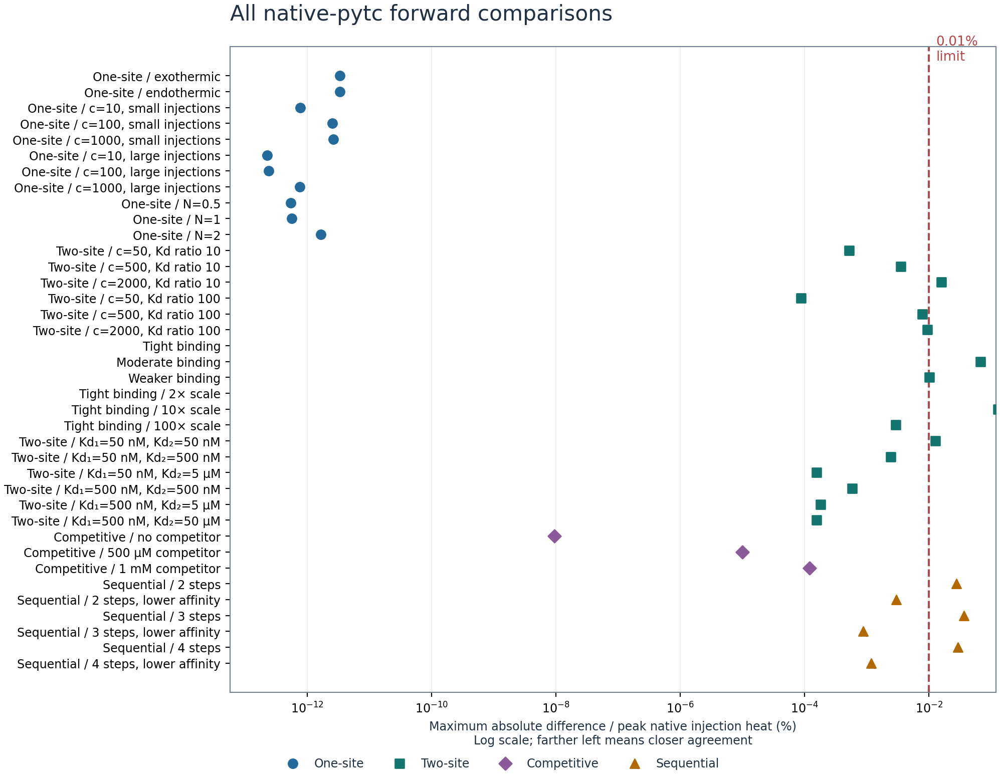

| Case | Injections | Maximum error (% of peak) | Result |
|---|---:|---:|---|
| one-exothermic | 40 | 3.30603e-12 | PASS |
| one-endothermic | 40 | 3.30603e-12 | PASS |
| one-c10-small | 25 | 7.63413e-13 | PASS |
| one-c100-small | 25 | 2.50598e-12 | PASS |
| one-c1000-small | 25 | 2.63432e-12 | PASS |
| one-c10-large | 12 | 2.26402e-13 | PASS |
| one-c100-large | 12 | 2.39567e-13 | PASS |
| one-c1000-large | 12 | 7.46417e-13 | PASS |
| one-n05 | 25 | 5.34339e-13 | PASS |
| one-n1 | 25 | 5.5995e-13 | PASS |
| one-n2 | 25 | 1.64315e-12 | PASS |
| two-c50-r10 | 40 | 0.000523358 | PASS |
| two-c500-r10 | 40 | 0.00351189 | PASS |
| two-c2000-r10 | 40 | 0.0158002 | FAILED |
| two-c50-r100 | 40 | 8.73266e-05 | PASS |
| two-c500-r100 | 40 | 0.00787997 | PASS |
| two-c2000-r100 | 40 | 0.00939073 | PASS |
| two-realistic | 25 | 2.1759 | FAILED |
| two-realistic-500pM | 25 | 0.0674479 | FAILED |
| two-realistic-5nM | 25 | 0.0101037 | FAILED |
| two-tight-scale-2x | 25 | 0.829774 | FAILED |
| two-tight-scale-10x | 25 | 0.128328 | FAILED |
| two-tight-scale-100x | 25 | 0.0029265 | PASS |
| two-kd50-50 | 25 | 0.0125903 | FAILED |
| two-kd50-500 | 25 | 0.00241559 | PASS |
| two-kd50-5000 | 25 | 0.000156474 | PASS |
| two-kd500-500 | 25 | 0.000575567 | PASS |
| two-kd500-5000 | 25 | 0.000181858 | PASS |
| two-kd500-50000 | 25 | 0.000156474 | PASS |
| competitive-0 | 40 | 9.47939e-09 | PASS |
| competitive-500 | 40 | 9.97615e-06 | PASS |
| competitive-1000 | 40 | 0.000120503 | PASS |
| sequential-2 | 60 | 0.0274914 | FAILED |
| sequential-2-low-affinity | 60 | 0.00299779 | PASS |
| sequential-3 | 60 | 0.0364929 | FAILED |
| sequential-3-low-affinity | 60 | 0.000879565 | PASS |
| sequential-4 | 60 | 0.0290479 | FAILED |
| sequential-4-low-affinity | 60 | 0.00116796 | PASS |

## How to read the graphs

Blue lines are native integrated heats; orange open circles are FT-ITC predictions, one point per actual injection. The horizontal axis is nominal molar ratio (total titrant / initial cell macromolecule). Connecting lines are visual guides, not sub-injections. Lower panels show signed error as a percentage of the same dataset peak, with a zoomed vertical scale for each case. Use the overview and the printed maximum to compare with 0.01%; residual panel heights are not comparable across cases.

### Two independent sites: two-c50-r10 / two-c500-r10 / two-c2000-r10

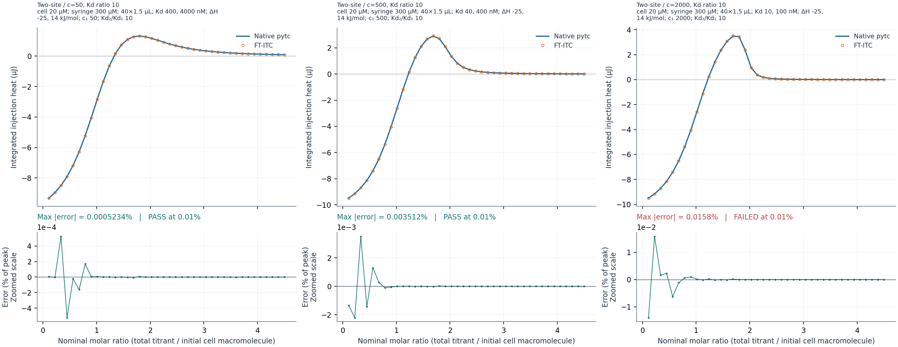

two-c50-r10: cell 20 µM; syringe 0.3 mM; initial ligand 0 µM; 40 injections of 1.5 µL. log10 Ka = [6.39794, 5.39794]; enthalpies = [-25, 14] kJ/mol; N = [1, 1]; c = 50; Kd2/Kd1 = 10; Kd = [400, 4000] nM.

two-c500-r10: cell 20 µM; syringe 0.3 mM; initial ligand 0 µM; 40 injections of 1.5 µL. log10 Ka = [7.39794, 6.39794]; enthalpies = [-25, 14] kJ/mol; N = [1, 1]; c = 500; Kd2/Kd1 = 10; Kd = [40, 400] nM.

two-c2000-r10: cell 20 µM; syringe 0.3 mM; initial ligand 0 µM; 40 injections of 1.5 µL. log10 Ka = [8, 7]; enthalpies = [-25, 14] kJ/mol; N = [1, 1]; c = 2000; Kd2/Kd1 = 10; Kd = [10, 100] nM.

### Two independent sites: two-c50-r100 / two-c500-r100 / two-c2000-r100

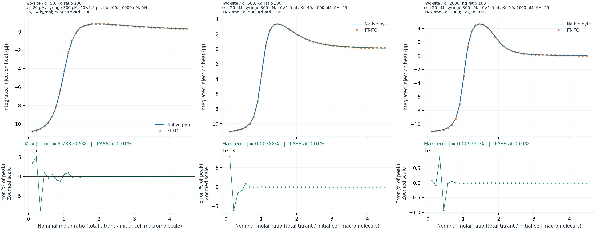

two-c50-r100: cell 20 µM; syringe 0.3 mM; initial ligand 0 µM; 40 injections of 1.5 µL. log10 Ka = [6.39794, 4.39794]; enthalpies = [-25, 14] kJ/mol; N = [1, 1]; c = 50; Kd2/Kd1 = 100; Kd = [400, 40000] nM.

two-c500-r100: cell 20 µM; syringe 0.3 mM; initial ligand 0 µM; 40 injections of 1.5 µL. log10 Ka = [7.39794, 5.39794]; enthalpies = [-25, 14] kJ/mol; N = [1, 1]; c = 500; Kd2/Kd1 = 100; Kd = [40, 4000] nM.

two-c2000-r100: cell 20 µM; syringe 0.3 mM; initial ligand 0 µM; 40 injections of 1.5 µL. log10 Ka = [8, 6]; enthalpies = [-25, 14] kJ/mol; N = [1, 1]; c = 2000; Kd2/Kd1 = 100; Kd = [10, 1000] nM.

### Two independent sites: two-realistic / two-realistic-500pM / two-realistic-5nM

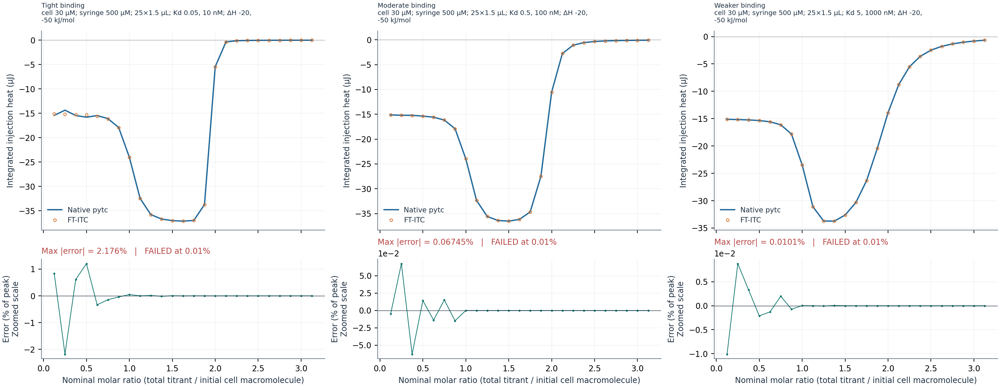

two-realistic: cell 30 µM; syringe 0.5 mM; initial ligand 0 µM; 25 injections of 1.5 µL. log10 Ka = [10.301, 8]; enthalpies = [-20, -50] kJ/mol; N = [1, 1]; Kd = [0.05, 10] nM.

two-realistic-500pM: cell 30 µM; syringe 0.5 mM; initial ligand 0 µM; 25 injections of 1.5 µL. log10 Ka = [9.30103, 7]; enthalpies = [-20, -50] kJ/mol; N = [1, 1]; Kd = [0.5, 100] nM.

two-realistic-5nM: cell 30 µM; syringe 0.5 mM; initial ligand 0 µM; 25 injections of 1.5 µL. log10 Ka = [8.30103, 6]; enthalpies = [-20, -50] kJ/mol; N = [1, 1]; Kd = [5, 1000] nM.

### Two independent sites: two-tight-scale-2x / two-tight-scale-10x / two-tight-scale-100x

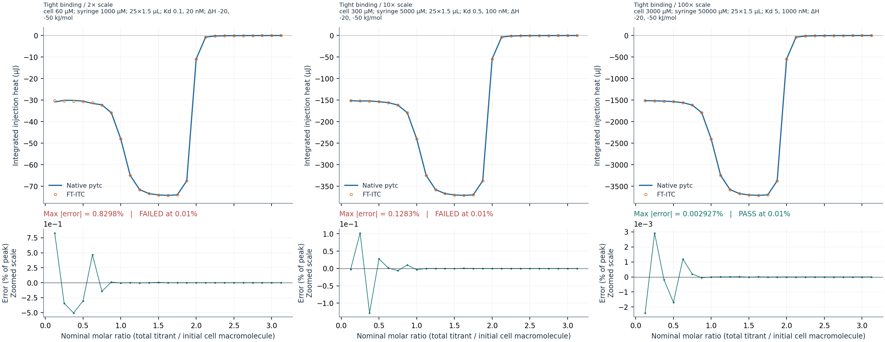

two-tight-scale-2x: cell 60 µM; syringe 1 mM; initial ligand 0 µM; 25 injections of 1.5 µL. log10 Ka = [10, 7.69897]; enthalpies = [-20, -50] kJ/mol; N = [1, 1]; Kd = [0.1, 20] nM.

two-tight-scale-10x: cell 300 µM; syringe 5 mM; initial ligand 0 µM; 25 injections of 1.5 µL. log10 Ka = [9.30103, 7]; enthalpies = [-20, -50] kJ/mol; N = [1, 1]; Kd = [0.5, 100] nM.

two-tight-scale-100x: cell 3000 µM; syringe 50 mM; initial ligand 0 µM; 25 injections of 1.5 µL. log10 Ka = [8.30103, 6]; enthalpies = [-20, -50] kJ/mol; N = [1, 1]; Kd = [5, 1000] nM.

### Two independent sites: two-kd50-50 / two-kd50-500 / two-kd50-5000

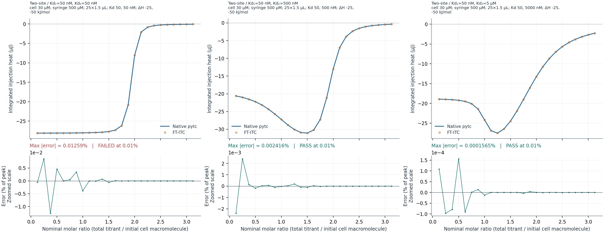

two-kd50-50: cell 30 µM; syringe 0.5 mM; initial ligand 0 µM; 25 injections of 1.5 µL. log10 Ka = [7.30103, 7.30103]; enthalpies = [-25, -50] kJ/mol; N = [1, 1]; Kd = [50, 50] nM.

two-kd50-500: cell 30 µM; syringe 0.5 mM; initial ligand 0 µM; 25 injections of 1.5 µL. log10 Ka = [7.30103, 6.30103]; enthalpies = [-25, -50] kJ/mol; N = [1, 1]; Kd = [50, 500] nM.

two-kd50-5000: cell 30 µM; syringe 0.5 mM; initial ligand 0 µM; 25 injections of 1.5 µL. log10 Ka = [7.30103, 5.30103]; enthalpies = [-25, -50] kJ/mol; N = [1, 1]; Kd = [50, 5000] nM.

### Two independent sites: two-kd500-500 / two-kd500-5000 / two-kd500-50000

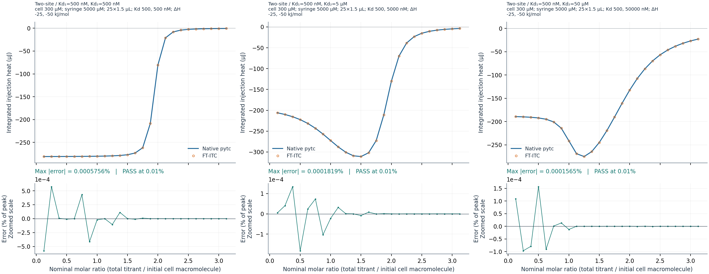

two-kd500-500: cell 300 µM; syringe 5 mM; initial ligand 0 µM; 25 injections of 1.5 µL. log10 Ka = [6.30103, 6.30103]; enthalpies = [-25, -50] kJ/mol; N = [1, 1]; Kd = [500, 500] nM.

two-kd500-5000: cell 300 µM; syringe 5 mM; initial ligand 0 µM; 25 injections of 1.5 µL. log10 Ka = [6.30103, 5.30103]; enthalpies = [-25, -50] kJ/mol; N = [1, 1]; Kd = [500, 5000] nM.

two-kd500-50000: cell 300 µM; syringe 5 mM; initial ligand 0 µM; 25 injections of 1.5 µL. log10 Ka = [6.30103, 4.30103]; enthalpies = [-25, -50] kJ/mol; N = [1, 1]; Kd = [500, 50000] nM.

### One-site binding: one-exothermic / one-endothermic

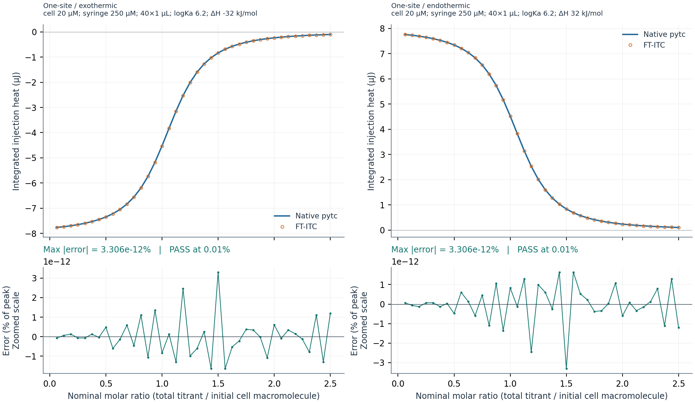

one-exothermic: cell 20 µM; syringe 0.25 mM; initial ligand 0 µM; 40 injections of 1 µL. log10 Ka = [6.2]; enthalpies = [-32] kJ/mol; N = [1.1].

one-endothermic: cell 20 µM; syringe 0.25 mM; initial ligand 0 µM; 40 injections of 1 µL. log10 Ka = [6.2]; enthalpies = [32] kJ/mol; N = [1.1].

### One-site binding: one-c10-small / one-c10-large

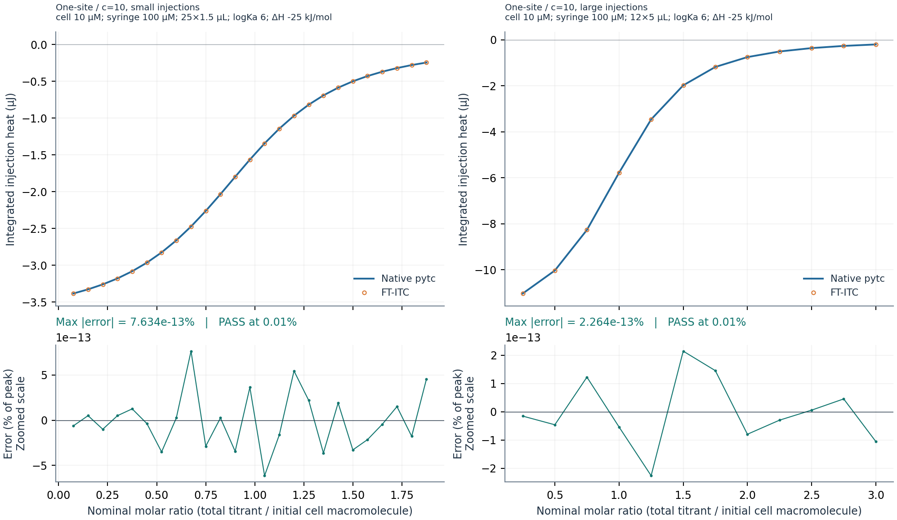

one-c10-small: cell 10 µM; syringe 0.1 mM; initial ligand 0 µM; 25 injections of 1.5 µL. log10 Ka = [6]; enthalpies = [-25] kJ/mol; N = [1]; c = 10.

one-c10-large: cell 10 µM; syringe 0.1 mM; initial ligand 0 µM; 12 injections of 5 µL. log10 Ka = [6]; enthalpies = [-25] kJ/mol; N = [1]; c = 10.

### One-site binding: one-c100-small / one-c100-large

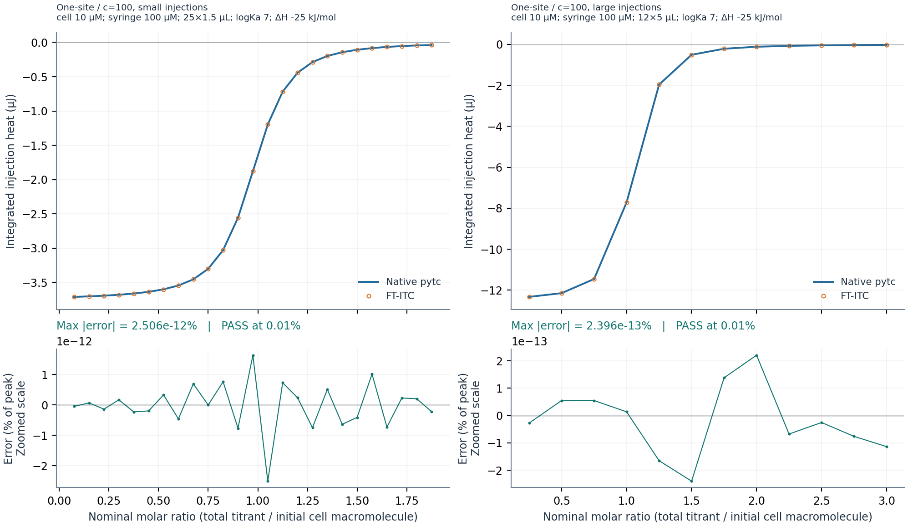

one-c100-small: cell 10 µM; syringe 0.1 mM; initial ligand 0 µM; 25 injections of 1.5 µL. log10 Ka = [7]; enthalpies = [-25] kJ/mol; N = [1]; c = 100.

one-c100-large: cell 10 µM; syringe 0.1 mM; initial ligand 0 µM; 12 injections of 5 µL. log10 Ka = [7]; enthalpies = [-25] kJ/mol; N = [1]; c = 100.

### One-site binding: one-c1000-small / one-c1000-large

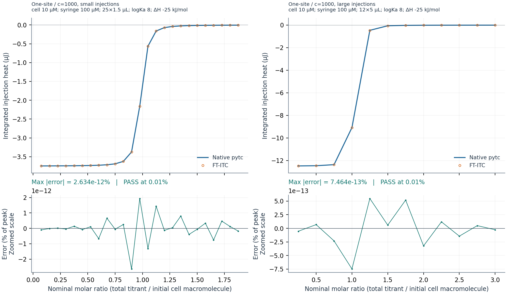

one-c1000-small: cell 10 µM; syringe 0.1 mM; initial ligand 0 µM; 25 injections of 1.5 µL. log10 Ka = [8]; enthalpies = [-25] kJ/mol; N = [1]; c = 1000.

one-c1000-large: cell 10 µM; syringe 0.1 mM; initial ligand 0 µM; 12 injections of 5 µL. log10 Ka = [8]; enthalpies = [-25] kJ/mol; N = [1]; c = 1000.

### One-site binding: one-n05 / one-n1 / one-n2

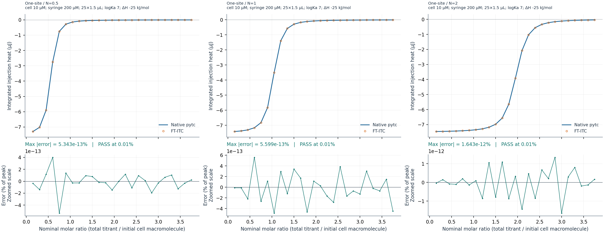

one-n05: cell 10 µM; syringe 0.2 mM; initial ligand 0 µM; 25 injections of 1.5 µL. log10 Ka = [7]; enthalpies = [-25] kJ/mol; N = [0.5].

one-n1: cell 10 µM; syringe 0.2 mM; initial ligand 0 µM; 25 injections of 1.5 µL. log10 Ka = [7]; enthalpies = [-25] kJ/mol; N = [1].

one-n2: cell 10 µM; syringe 0.2 mM; initial ligand 0 µM; 25 injections of 1.5 µL. log10 Ka = [7]; enthalpies = [-25] kJ/mol; N = [2].

### Competitive binding: competitive-0 / competitive-500 / competitive-1000

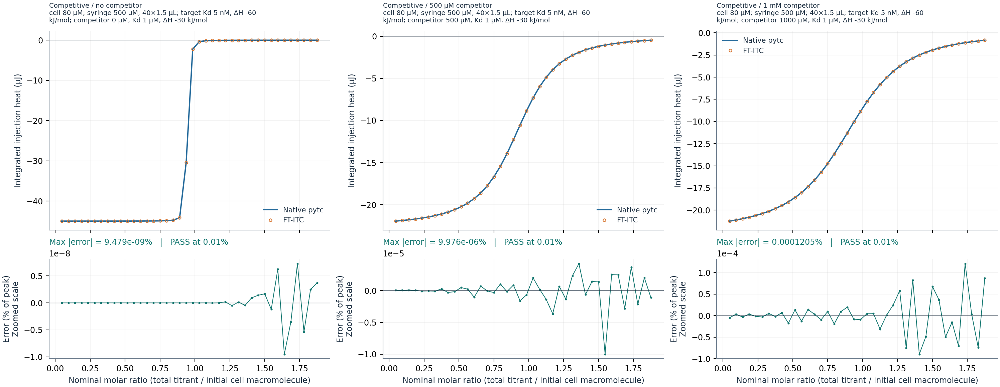

competitive-0: cell 80 µM; syringe 0.5 mM; initial ligand 0 µM; 40 injections of 1.5 µL. log10 Ka = [8.30103]; enthalpies = [-60] kJ/mol; N = [1]; competitor 0 µM, log10 Ka 6, enthalpy -30 kJ/mol.

competitive-500: cell 80 µM; syringe 0.5 mM; initial ligand 0 µM; 40 injections of 1.5 µL. log10 Ka = [8.30103]; enthalpies = [-60] kJ/mol; N = [1]; competitor 500 µM, log10 Ka 6, enthalpy -30 kJ/mol.

competitive-1000: cell 80 µM; syringe 0.5 mM; initial ligand 0 µM; 40 injections of 1.5 µL. log10 Ka = [8.30103]; enthalpies = [-60] kJ/mol; N = [1]; competitor 1000 µM, log10 Ka 6, enthalpy -30 kJ/mol.

### Sequential binding: sequential-2 / sequential-3 / sequential-4

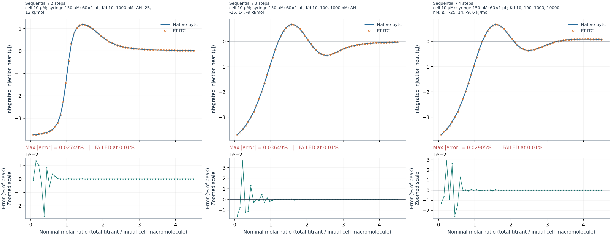

sequential-2: cell 10 µM; syringe 0.15 mM; initial ligand 0 µM; 60 injections of 1 µL. log10 Ka = [8, 6]; enthalpies = [-25, 12] kJ/mol.

sequential-3: cell 10 µM; syringe 0.15 mM; initial ligand 0 µM; 60 injections of 1 µL. log10 Ka = [8, 7, 6]; enthalpies = [-25, 14, -9] kJ/mol.

sequential-4: cell 10 µM; syringe 0.15 mM; initial ligand 0 µM; 60 injections of 1 µL. log10 Ka = [8, 7, 6, 5]; enthalpies = [-25, 14, -9, 6] kJ/mol.

### Sequential binding: sequential-2-low-affinity / sequential-3-low-affinity / sequential-4-low-affinity

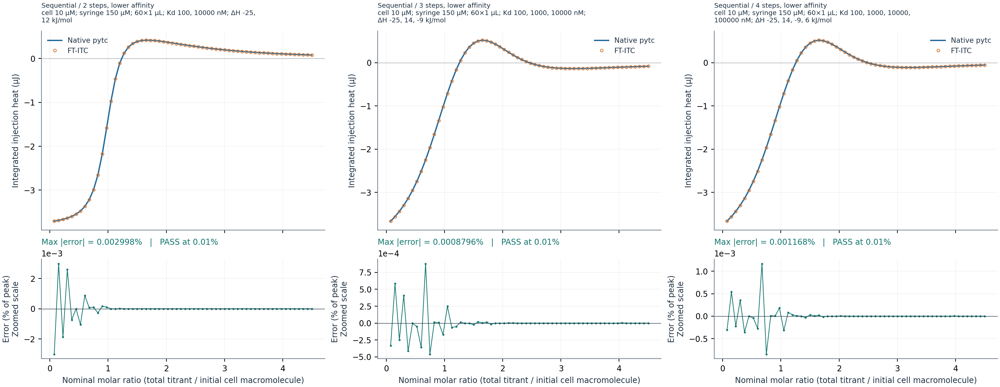

sequential-2-low-affinity: cell 10 µM; syringe 0.15 mM; initial ligand 0 µM; 60 injections of 1 µL. log10 Ka = [7, 5]; enthalpies = [-25, 12] kJ/mol.

sequential-3-low-affinity: cell 10 µM; syringe 0.15 mM; initial ligand 0 µM; 60 injections of 1 µL. log10 Ka = [7, 6, 5]; enthalpies = [-25, 14, -9] kJ/mol.

sequential-4-low-affinity: cell 10 µM; syringe 0.15 mM; initial ligand 0 µM; 60 injections of 1 µL. log10 Ka = [7, 6, 5, 4]; enthalpies = [-25, 14, -9, 6] kJ/mol.

## Limitations and numerical differences

The six passing external two-site cases validate one site of each type, not arbitrary independent fractional stoichiometries. The fractional-stoichiometry and monomer-dimer dissociation tests remain separate analytical FT-ITC extension tests; they are not native-pytc forward comparisons. Initial-ligand cases validate a prescribed segment start, not tandem inter-segment back-mixing. Agreement verifies the implementation for these cases, not empirical superiority of the mixing model. A forward test does not establish parameter identifiability or fitting robustness.

Different numerical solvers are retained. Native BindingPolynomial uses an absolute free-ligand Different numerical solvers are retained; the practical acceptance limit is 0.01% of peak injection heat. No tolerance was relaxed for these cases.

## Test-run evidence

- Focused pytc suite: 67 passed, 0 failed, 0 skipped (67 total).
- Full shared-core suite: 1318 passed, 5 failed, 1 skipped (1324 total).

The full-suite failures below are reported separately from the native forward comparisons; this report does not claim that the full core suite passed.

- AnalysisITC.Core.Tests.PublishedOneSiteMultiStartTests.PublishedPytcFitRecoversFromPredeterminedAlternativeStarts(algorithm: NelderMead, dilution: MicroCal)
- AnalysisITC.Core.Tests.PublishedElifeNrampOneSiteModelTests.OneSetOfSitesReproducesOriginOneSiteFits(fixtureName: "elife2023-d369a-mn-onesite-first-run.DH", originAssociationConstant: 2590, originEnthalpyCalPerMole: 9478, dilutionMethod: MicroCal, solverAlgorithm: LevenbergMarquardt)
- AnalysisITC.Core.Tests.Wu2023HsaCoSequentialBenchmarkTests.H67AFigureIntegratedHeatsRecoverPublishedTwoStepSequentialFit(algorithm: LevenbergMarquardt)
- AnalysisITC.Core.Tests.Wu2023HsaCoSequentialBenchmarkTests.H67AFigureIntegratedHeatsRecoverPublishedTwoStepSequentialFit(algorithm: NelderMead)
- AnalysisITC.Core.Tests.PublishedElifeNrampOneSiteModelTests.OneSetOfSitesReproducesOriginOneSiteFits(fixtureName: "elife2023-d369a-mn-onesite-first-run.DH", originAssociationConstant: 2590, originEnthalpyCalPerMole: 9478, dilutionMethod: MicroCal, solverAlgorithm: NelderMead)

## Provenance and reproduction

[Pinned native pytc source](https://github.com/harmslab/pytc/tree/d9ccde3f04e35a3d821ff37a4ad42e62a048d4ac/pytc/indiv_models); [binding-polynomial documentation](https://pytc.readthedocs.io/en/latest/indiv_models/binding-polynomial.html).

Reference SHA-256: `fedec61fed204284f050f17583c7803f922a0589abc1228f322cf5b89e8a01f9`

Comparison SHA-256: `797e5e3734847ea59233dbc577d791fb0ffce197eee3270117abd6dbc41e3805`

See README.md for generation/test commands. This report and all plots are regenerated from reference.json and the C#-exported comparisons.json; the report builder computes no equilibrium predictions.
