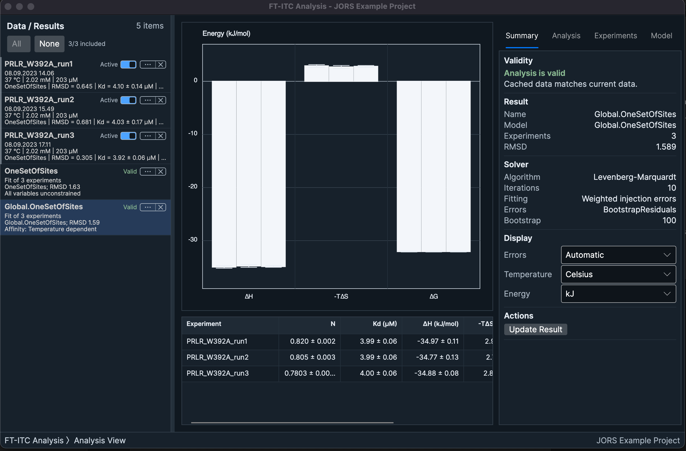

# FT-ITC Analysis user manual

FT-ITC Analysis is a desktop application for processing, fitting, comparing, and presenting isothermal titration calorimetry (ITC) experiments. This manual is for people who already understand the purpose and basic practice of ITC but are new to this application. No programming is required.

The instructions apply to the native macOS application and the cross-platform application for macOS, Windows, and Linux. Both are described as one product. A **Platform note** appears only when an operating-system or interface difference changes how you complete a task.

> **Verified:** The procedures in this edition were checked against FT-ITC Analysis 1.4.3. Each page shows its own verification date.

## What the application does

FT-ITC Analysis supports the complete path from compatible instrument data to an analysis project and publication-oriented output:

1. Open a raw thermogram, integrated heats, or an existing project.
2. Check experiment details and concentrations.
3. Establish a baseline and integrate injection peaks when a thermogram is available.
4. Fit one experiment or a set of experiments to a supported model.
5. Review the solution, uncertainty, residuals, and result validity.
6. Create a final figure or export data and result tables.
7. Save the analysis as a portable `.ftxtc` project.

Raw input files are read, not rewritten. Ordinary analysis is local: the application does not upload experiment data. An optional launch-time online check retrieves version and citation information.

## Product tour

The data list contains loaded experiments and completed Analysis Results. Selecting an experiment exposes four shared task views:

- **Overview** summarizes the experiment and provides access to its details.
- **Process Data** controls baseline correction and peak integration.
- **Analyze Data** fits a single experiment or multiple experiments.
- **Final Figure** presents the thermogram, heats, fitted curve, residuals, and annotations.

Selecting an Analysis Result opens its summary, member fits, parameters, uncertainty display, and any compatible advanced analyses. The menus provide project operations, experiment management, export commands, preferences, additional tools, citation information, and support links.

## How to use this manual

If you want a first result, follow [Quick start](quick-start.md). It deliberately uses your own compatible data instead of a bundled tutorial dataset. Continue to the task chapter when you need to understand a setting or diagnose a result.

The manual uses these callouts:

> **Note:** A detail that affects how the application behaves.

> **Caution:** A condition that can produce a failed task, invalid result, or misleading output.

> **Interpretation:** Scientific context for judging output; it is not an automated conclusion made by the application.

> **Recommendation:** A defensible working practice rather than a software requirement.

Interface labels appear in **bold**. A path such as **File > Save As...** means choose the menu and then the command. The names of views and controls are used instead of position-dependent phrases, so the instruction remains usable when the window size or platform changes.

## Scope

The manual explains every supported end-user workflow: projects and recovery, thermogram processing, model fitting, global analysis, results, advanced analyses, figures and exports, experiment design, buffer subtraction, experiment merging, preferences, and troubleshooting.

It does not document application architecture, developer workflows, the internal `.ftxtc` wire format, source-code APIs, or exhaustive derivations of the numerical methods. The [project repository](https://github.com/FrederikTheisen/FT-ITC-Analysis) and its technical documentation cover maintainer topics.

## Next steps

- [Quick start](quick-start.md) - complete one ordinary analysis.
- [Installation, files, and projects](installation-files-projects.md) - install the application and protect your work.
- [Reference](reference.md) - look up formats, symbols, terminology, and model-selection reminders.

*The common Analysis Result workspace. Screenshots use the cross-platform application; procedures are verified for the native macOS application as well.*
