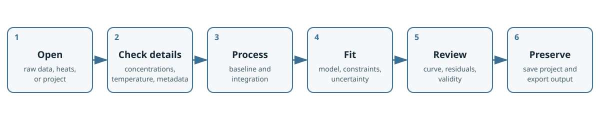

# Quick start

This procedure takes a compatible file through an ordinary one-set-of-sites analysis. Use a dataset for which that model is scientifically plausible. The goal is to learn the application workflow, not to prescribe the correct model for every interaction.

*The overall analysis workflow. Integrated-heat imports enter after thermogram processing.*

## Before you begin

Have one of these inputs available:

- a raw MicroCal-style thermogram (`.itc`) or native TA Instruments NanoITC file (`.nitc`).
- a NanoAnalyze export (`.ta`) or PEAQ-ITC export (`.apj`).
- a legacy Origin ITC project (`.opj`). When a compatible worksheet contains the original time/power trace, FT-ITC Analysis restores it for processing; otherwise, it uses the worksheet heat values as integrated input.
- injection-level integrated heats (`.dat`, `.aff`, or `.dh`).
- an FT-ITC project (`.ftxtc`) or legacy project (`.ftitc`).

Supported formats and project behavior are described in [Installation, files, and projects](03-installation-files-projects.md).

> **Note:** Integrated-heat files and Origin projects without an original time/power trace skip baseline correction and peak integration; begin with experiment details and fitting.

## 1. Open your data

Launch FT-ITC Analysis and choose **Open File...** on the welcome screen, choose **File > Open...**, or drag compatible files into the application window. Select your file and confirm the open operation.

The experiment appears in the data list. Select it and open **Overview** to orient yourself in the imported experiment.

## 2. Edit experiment details

Open **Details...** for the selected experiment. Concentration entries can be changed here when needed. Comments and attributes relevant to later analysis can also be added or edited.

Apply corrections only when you have an independent experimental basis. Concentration entries influence the calculated concentration ratio and fitted parameters.

## 3. Process a raw thermogram

If the import contains a thermogram, open **Process Data**.

1. If the trace shows a smooth global drift, try **Polynomial** baseline. For more complicated baseline shapes, choose **Spline**; for local baseline behavior, choose **Segmented**. Keep the default integration settings initially.
2. Inspect whether the baseline represents the signal between injections rather than the peaks.
3. Inspect the start and end of every integration region. A region should include the injection response without extending unnecessarily into baseline noise. Zoom to a peak and adjust the integration end point. Use **Space** to copy settings to the next injection.

These baseline alternatives are explained in [Processing](05-processing-thermograms.md).

> **Interpretation:** A visually smooth baseline is generally desired. As a rough rule of thumb, aim for about 20% of the data points to be baseline data; this is guidance, not a hard threshold. Apparent jumps in the baseline may indicate insufficient equilibration time between injections. Major spikes may require advanced baseline editing; the **Spline** baseline type provides more flexibility.

## 4. Fit one set of sites

Open **Analyze Data**, choose **Single experiment**, and select **One-Set-Of-Sites**.

1. Review the initial parameter values. Use physically plausible orders of magnitude for affinity, enthalpy, and stoichiometry.
2. Choose an optimizer. **Levenberg-Marquardt** is efficient near a suitable solution; **Nelder-Mead** can be useful when the starting surface is less cooperative.
3. Optionally enable **Weight by injection error** when the integration uncertainties are meaningful for the dataset.
4. Choose **None**, **Bootstrap residuals**, or **Leave-one-out** for error estimation.
5. Choose **Run Fit**.

**Create analysis result** determines whether a usable fit also creates a separate Analysis Result. Enable it to continue through the result workspace in the next step; otherwise, the fitted solution remains attached to the Experiment Data.

If the fit fails or reaches a limit, the possible causes are described under [Fit availability and non-convergence](06-fitting-models.md#fit-availability-and-non-convergence).

## 5. Review the result

Inspect the fitted curve together with the residuals. When **Create analysis result** is enabled, select the resulting **Analysis Result** and check:

- the included experiment and injections;
- fitted parameter values and units;
- convergence and fit loss;
- whether weighting and uncertainty estimation match your intention;
- parameter uncertainty or confidence intervals, when calculated;
- result validity.

When **Create analysis result** is disabled, the fitted solution remains available in **Analyze Data** rather than as a stored Analysis Result.

> **Interpretation:** Parameter precision does not establish model adequacy. Look for structured residuals, sensitivity to initial values, values at limits, excessive parameter correlation, or disagreement with known stoichiometry and experimental conditions.

## 6. Save a portable project

Choose **File > Save As...** and save the project as `.ftxtc`. The project contains imported data, experiment details, processing state, fits, results, and available advanced-analysis output. Keep the original instrument files as source records even though the project is portable.

If autosave is enabled, it supplements normal saving; it is not a replacement for a named project file.

## 7. Export a figure

Return to the experiment and open **Final Figure**. Choose the elements you need, such as the thermogram, integrated heats, fitted curve, residuals, confidence band, or parameter information. Review axis ranges and labels, then use the figure export or print command provided by the view.

Use **Analysis Result Exporter...** when you need numerical result tables rather than a graphic. For injection-level heats, open **File > Export Data...** and choose **Integrated Peaks**.

The figure and table workflows continue in [Figures and export](09-figures-printing-export.md).
