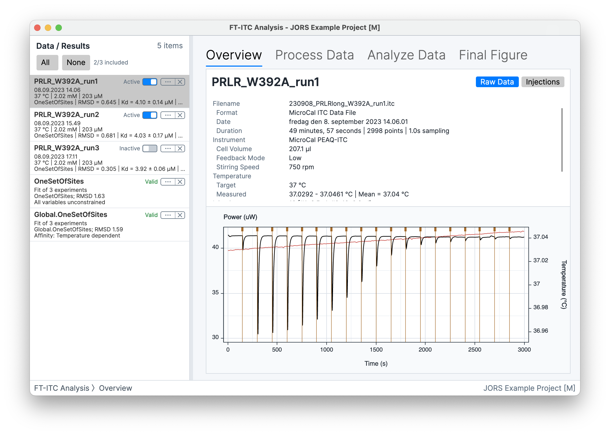

# Workspace

## Application window

**Selected** means the item currently shown in the workspace. **Active** means an experiment is included in operations that use a group of experiments. Selecting a row does not automatically make it Active.

The **Data / Results** list is the project navigator. It contains two types of project item: Experiment Data and completed Analysis Results. Selecting an item shows it in the workspace.

Only Experiment Data has an **Active** toggle. **Active** experiments participate in operations that use a group of datasets, such as multiple-experiment fitting, processing propagation, and coordinated export. The toggle becomes available after the experiment has been processed. **Enable All**, **Disable All**, and **Invert Active** change several experiments. The **Sort** commands order the list by name, date, temperature, type, ionic strength, or protonation enthalpy. Multiple-experiment fitting is described in [Multiple-experiment fitting](07-multiple-experiments.md), and the processing prerequisite is covered in [Processing](05-processing-thermograms.md).

The rest of the window changes to match the selected item and task:

- The workflow navigator switches between the available stages of an experiment.
- The workspace contains the graphs, tables, and controls for the current task.
- Workflow controls provide options for the view or analysis currently open.
- Item actions apply to the selected Experiment Data or Analysis Result.
- The application menu contains project commands, tools, preferences, and help.

## Experiment Data

*Selecting Experiment Data opens its experiment workflow in the shared workspace.*

Experiment Data represents an imported or application-created dataset. Its list entry provides identifying information and a summary of its processing and fitting status.

### Experiment workflow

Four task views are available for Experiment Data:

- **Overview** presents the imported data and available experiment information.
- **Process Data** turns a raw thermogram into integrated heats through baseline modeling and injection-region control.
- **Analyze Data** configures and runs single- or multiple-experiment fitting.
- **Final Figure** prepares the thermogram, integrated heats, fit, residuals, and annotations for presentation.

### Details and attributes

The **Details...** view contains editable concentrations, comments, and experiment attributes. The macOS sheet has separate **Details** and **Attributes** tabs: Details contains the experiment name, date/time, conditions, concentrations, and comments; Attributes contains optional metadata. Attributes describe conditions and analysis inputs such as buffer, salt, ionic strength, competitor, or prebound species.

> **Platform note (macOS):** Edit the date and time using separate native controls, including seconds. Use **Add Attribute** on the Attributes tab to add a row. Each tab scrolls independently while **Cancel** and **Apply** remain visible at the bottom. Cancel discards edits; Apply saves them.

**Copy Attributes to All** copies all attributes from the selected experiment to every other experiment. **Attribute Operations...** copies either one attribute or all attributes to **All other experiments**, **Active experiments**, a **Specific experiment**, or **Experiment names containing...**. The name option targets every other experiment whose name contains the entered text, without regard to capitalization. **Clear Attributes** removes all attributes from the selected experiment after confirmation.

### Experiment Data actions

- **Details...** opens the editable experiment information and attributes.
- **Duplicate Data** creates another project item from the selected Experiment Data.
- **Export Selected Data...** exports the selected dataset.
- **Clear Solution** removes the fitted solution currently attached to the Experiment Data.
- **Remove Data** removes the item from the open project without deleting its source file.

## Analysis Result

*An Analysis Result opens its dedicated result workspace when selected.*

An Analysis Result stores a fit for one or more experiments together with its model, constraints, fitting settings, uncertainty output, and member solutions. Its list entry summarizes the stored fit.

### Result workspace

The result workspace provides these views:

- **Summary** compares fitted and derived parameters across the result and provides its member table.
- **Fit** shows the stored fitted curve and residuals for a selected member experiment.
- **Correlation** shows parameter correlations calculated from residual-bootstrap refits when sufficient bootstrap information is available.
- **Temperature**, **Salt**, and **Protonation** appear when the result and its experiment information support those analyses.

The inspector organizes result information under **Summary**, **Analysis**, **Experiments**, and **Model**. See [Results and advanced analyses](08-results-advanced-analysis.md) for interpretation and prerequisites.

### Analysis Result actions

- **Details...** edits the result name and comments.
- In Avalonia, **Copy Result Table** copies the selected result table. On macOS, open **Analysis Result Exporter** and click **Copy to Clipboard**. The exporter also provides controlled table export.
- **Update Result** reruns the stored model and fitting settings using the current member experiments and replaces the result only after a successful fit. For bootstrap error estimation, you can increase the number of iterations when updating the result.
- **Set Active Experiments** makes the result's member experiments Active.
- **Load Solutions to Experiments** attaches the stored member solutions to their corresponding Experiment Data.
- **Export Associated Final Figures...** exports one figure per member experiment using that result's saved fit. It loads each saved solution only while making its figure, then restores the experiment's previous solution.
- **Remove Result** removes the Analysis Result from the open project.

## Separate tools

The **Tools** menu opens separate windows for tasks outside the main experiment and result workflows. These include **Experiment Designer...**, **Buffer Subtraction...**, and **Experiment Merger...**. Their features are described in [Tools](10-additional-tools.md).
