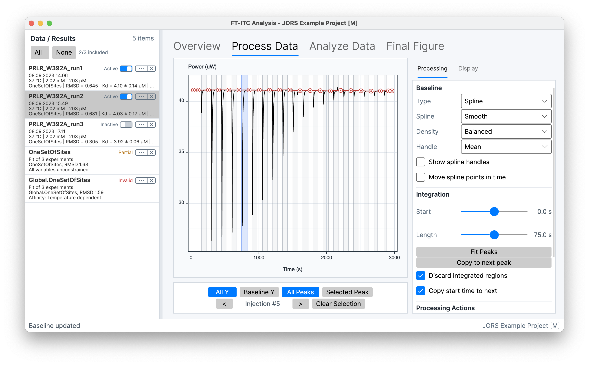
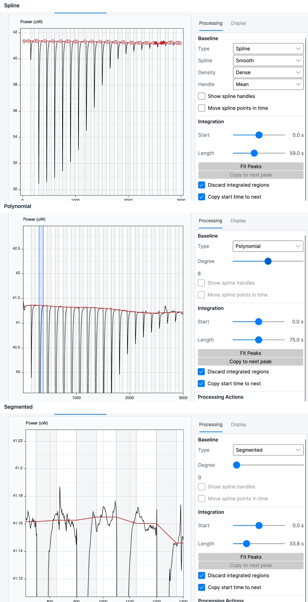
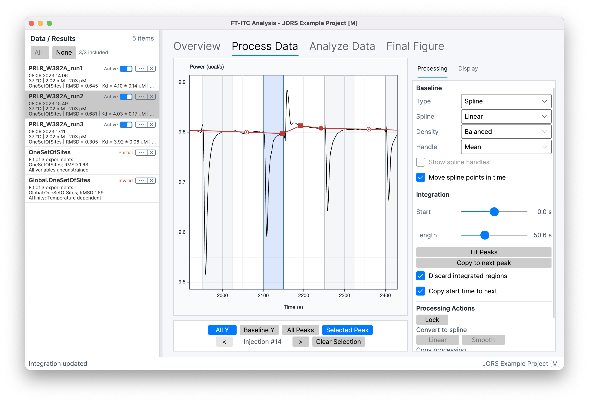

# Processing

The **Process Data** workspace estimates and subtracts a baseline from the differential-power trace and integrates the corrected response for each injection. Processing produces an injection heat with an estimated uncertainty for later fitting. The application cannot determine whether a baseline or integration boundary is scientifically appropriate for the experiment.

Raw `.itc`, `.nitc`, `.ta`, and `.apj` imports use this workflow, as do Origin `.opj` imports that contain a usable time/power trace. Integrated-heat imports and Origin projects without a usable trace skip **Process Data**.

> **Calculation:**
>
> *q*i,raw = ∫[*P*(*t*) − *b*(*t*)] d*t*
>
> *ΔH*i = *q*i / *n*i
>
> *n*i = *c*syr*V*i
>
> The integral is evaluated between the injection's integration boundaries. *P*(*t*) is differential power, *b*(*t*) is the estimated baseline, and *q*i,raw is the raw integrated heat. The heat *q*i equals that raw value unless optional buffer subtraction changes it. *c*syr is the syringe concentration, *V*i is the injection volume, *n*i is the injected amount, and *ΔH*i is the molar heat.

## Processing workspace

*Process Data combines the thermogram with baseline, integration, display, and navigation controls.*

The **Processing** controls configure the baseline and integration regions. The **Display** controls show or hide the baseline, integration regions, corrected data, and cursor information.

With **All injections** selected, **Start** and **Length** apply to every injection. A selected graph region targets one injection, and double-clicking it focuses the graph on that peak. The previous and next controls move through the injections; **Clear Selection** returns to all injections.

The view controls separate horizontal and vertical scaling:

- **All Y** shows the complete power range, while **Baseline Y** emphasizes the baseline region.
- **All Peaks** shows the full injection series, while **Selected Peak** focuses on the current injection.
- Dragging an empty part of the graph zooms into the selected region.

## Baseline models and editing

*Spline, Polynomial, and Segmented provide different baseline representations for thermogram processing.*

### Spline

**Spline** places points in usable baseline regions and interpolates between them. It provides the most direct graphical control.

- **Linear** connects the spline points with straight sections. **Smooth** produces a continuously varying baseline and supports editable slope handles.
- **Sparse**, **Balanced**, and **Dense** change the number of automatically generated points.
- **Mean**, **Median**, and **Min volatility** determine the representative power used for an automatically generated point.
- **Show spline handles** displays the slope handles for a Smooth spline. **Move spline points in time** allows a point to be dragged horizontally as well as vertically.

Dragging a point corrects its position. A secondary-click on the graph adds a point **At Data** or **At Baseline**. A secondary-click on an existing point exposes **Lock** or **Unlock**, **Mark Linear** or **Unmark Linear**, and **Remove**. Marking neighboring points as linear makes the interval between them straight. Locked points are retained when automatic spline points are regenerated.

**Balanced** provides the middle spline-point density. Greater density increases local flexibility but can also follow noise or absorb part of an injection response.

### Polynomial

**Polynomial** fits one polynomial across the complete thermogram and is suited to smooth global drift. **Degree** controls flexibility.

Polynomial behavior is least constrained at the beginning and end of the run, where a high degree can produce strong edge behavior. Additional degree increases flexibility whether it represents baseline drift or follows more of the trace.

### Segmented

**Segmented** fits local constant, linear, or quadratic baseline behavior between integration regions and blends the local estimates across the run. It is suited to locally changing drift for which one global polynomial is too rigid. **Degree** selects the local behavior.

Local flexibility can follow genuine drift, but it also makes the result more dependent on the integration boundaries and on the baseline immediately around each peak.

### Exclude integration regions from the baseline

When **Discard integrated regions** is enabled, data inside the current integration regions are excluded when the baseline is recalculated. Moving a boundary can therefore change both the integrated area and the estimated baseline.

> **Caution:** Boundaries should follow the observed response and a consistent processing rule, not the heat expected from a model.

### Convert to a spline

A Polynomial or Segmented baseline can be converted to a **Smooth** or **Linear** Spline when the automatic baseline is a useful starting point for graphical editing. Conversion changes the baseline representation and creates editable spline points.

## Integration regions

*Selecting an injection exposes its individual boundaries and navigation controls.*

Each injection region has a start and an end boundary. **Start** sets the offset of the start boundary relative to the injection. The value displayed as **Length** positions the end boundary that many seconds after the injection begins; it is not a separate processing mode.

Either boundary can be dragged in the graph or adjusted with the controls. The application constrains the start and end to a valid interval within the injection scope and preserves a minimum separation between them.

### Estimate end points with Fit Peaks

**Fit Peaks** estimates the end point of each injection from the decay of the baseline-corrected response. It changes the end boundaries and then integrates the resulting regions; it does not fit the integrated heats or select a persistent integration mode.

When peak fitting converges, the estimated boundaries replace the previous end points. If fitting fails or does not converge, the previous regions remain unchanged. Peak kinetics can vary across the titration, and the first injection can behave differently from the remaining series.

### Copy a region to the next injection

Selecting an injection and choosing **Copy to next peak**, or pressing **Space**, copies its end boundary and advances to the next injection. **Copy start time to next** includes the start boundary in that operation.

## Injection uncertainty

Each injection error bar represents an estimated ±1 standard deviation for that injection's molar heat. The estimate describes how local noise in the baseline-corrected thermogram propagates through the selected integration region. It is calculated independently for every injection, so the bars can vary across a titration.

The calculation uses baseline-corrected samples around the injection. It combines an estimate of local power noise with the temporal correlation between neighboring samples, the integration-region length, and uncertainty in the baseline level. A longer or noisier region will therefore often have a larger estimated uncertainty. When Buffer Subtraction is applied, the independent target and reference heat uncertainties are combined.

> **Caution:** At least two surrounding baseline samples and two samples inside the integration region are required. When the estimate cannot be calculated, the application stores zero. Integrated-heat imports also lack a thermogram from which to estimate this uncertainty. A zero or absent error bar can therefore mean that no processing-derived estimate is available; it does not establish that the injection has no uncertainty.

The bars do not include uncertainty in cell or syringe concentration, fitted parameters, or model-derived confidence bands. They also do not quantify baseline-model choice, integration-boundary choice, calibration error, other instrumental effects, or other systematic uncertainty. Consequently, they do not validate the selected processing or constitute confidence intervals for the true heat.

**Weight by injection error** can use these estimates in the fitting objective. Concentration uncertainty is handled separately in supported resampling calculations. Both behaviors are described under [Fitting calculation](06-fitting-models.md#fitting-calculation).

## Propagate and lock processing

**Active** under **Copy processing** copies the selected experiment's processing to the other Active experiments. This can replace existing processing when a destination is unlocked. **New** targets experiments that do not yet have processing.

Processing can be propagated while the source is unlocked. Locked destinations are not overwritten. After propagation, each processor that should be protected can be selected and set to **Lock**. Locking disables baseline, spline-point, integration-region, and peak-fitting edits; **Unlock** makes changes available again.
