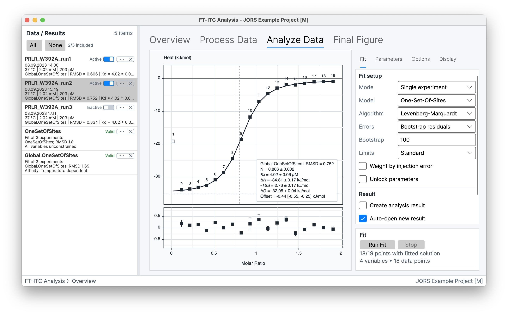
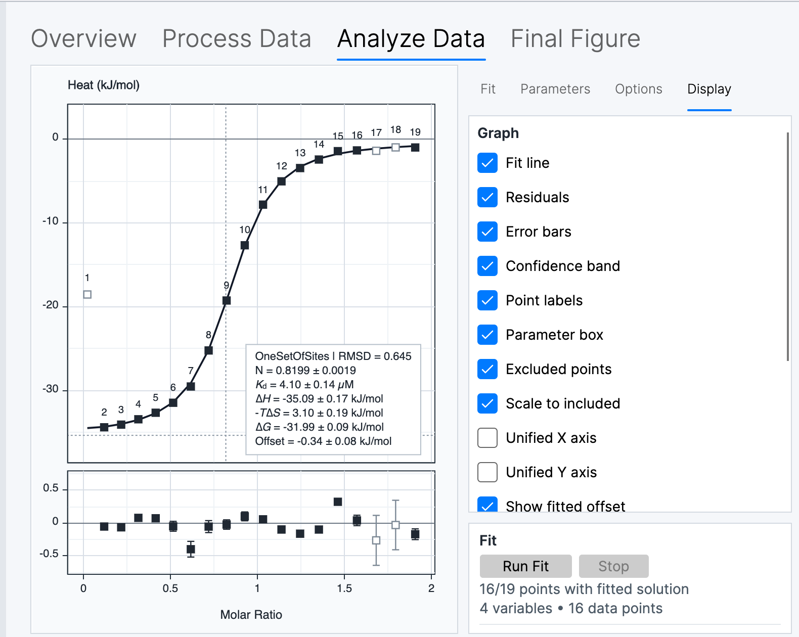
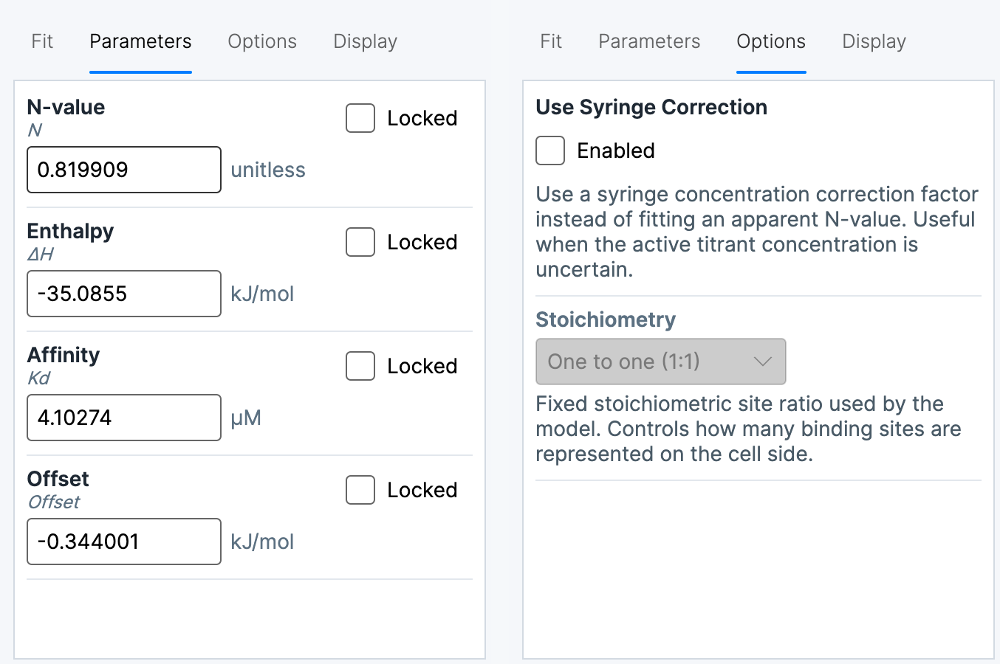

# Single-experiment fitting

**Analyze Data** in **Single experiment** mode fits the integrated heats of the selected Experiment Data. The fit uses the included injections together with the experiment concentrations, injection volumes, cell volume, temperature, and any model-specific information.

The inspector has four tabs:

- **Fit** selects the model, optimizer, error-estimation method, limits, weighting, and result output.
- **Parameters** shows the model parameters and their starting or fixed values.
- **Options** contains settings specific to the selected model.
- **Display** controls the fitted curve and diagnostic information shown in the graph.

*Analyze Data combines the fitted-heats graph and residuals with the controls for configuring and running the fit.*

Multiple-experiment fitting uses additional experiment selection and parameter constraints; see [Multiple-experiment fitting](07-multiple-experiments.md).

## Injection inclusion

Selecting an injection point in the integrated-heats graph changes whether it is included in the fit. Excluded injections do not contribute to the objective function. The **Excluded points** option in **Display** keeps excluded injections visible and available for selection.

*Excluded injections remain visible when Excluded points is enabled and can be selected for inclusion again.*

Changing injection inclusion does not rerun the fit. The fitted curve and parameters continue to represent the previous fit until **Run Fit** is used again. An inclusion change can also invalidate an Analysis Result that contains the experiment.

## Models

### One-Set-Of-Sites

**One-Set-Of-Sites** represents one class of equivalent, independent binding sites. It fits stoichiometry, dissociation constant, binding enthalpy, and an injection-heat offset. The solution also reports thermodynamic quantities derived from the fitted affinity and enthalpy.

The **Options** tab provides **Use Syringe Correction** and **Stoichiometry**. Without syringe correction, the fitted N-value represents the apparent site stoichiometry. With syringe correction enabled, **Stoichiometry** fixes the number of cell-side sites and the fitted N parameter becomes the active syringe-concentration factor `alpha`.

The model cannot by itself distinguish concentration uncertainty from other effects that change an apparent stoichiometry.

### Two-Sets-Of-Sites

**Two-Sets-Of-Sites** represents two independent classes of sites. It fits separate stoichiometries, dissociation constants, and enthalpies for the two classes, together with a shared injection-heat offset.

**Shared N-Values** makes the two site classes use the same fitted stoichiometry. **Use Syringe Correction** instead fixes the first and second **Stoichiometry** values and fits one active syringe-concentration factor, `alpha`.

The two site labels are interchangeable: exchanging all parameters assigned to site 1 and site 2 describes the same physical model. A lower fitting loss alone does not establish that two distinguishable binding processes are supported by the experiment.

### Sequential Binding Sites

**Sequential Binding Sites** represents two, three, or four ordered binding
steps on a macromolecule in the cell. **Sequential binding steps** in the
**Options** tab selects the fixed integral step count. The model fits one
macroscopic stepwise association constant and one molar step enthalpy for each
transition, together with the ordinary molar injection-heat offset. It does not
fit an N-value or syringe activity.

For step count *n*, let β0 = 1,
βi = ∏j=1…i*K*j, and let *x* be free ligand.
The state weights and fractions are

> **Calculation:**
>
> *w*i = βi*x*i
>
> *F*i = *w*i / Σj=0…n*w*j
>
> ν̄ = Σi=0…n*iF*i
>
> *X*t = *x* + *M*tν̄

Here *M*t and *X*t are total macromolecule and ligand
concentrations in the cell. The model solves the ligand balance internally and
calculates the cell heat content from the population of every sequential state:

> **Calculation:**
>
> *Q* = *V M*t Σi=1…n *F*i
> (Σj=1…i Δ*H*j)

The reported *K*i values are phenomenological, macroscopic step
constants for the ordered transitions *M* → *MX* → *MX*2 and so on.
They are not microscopic intrinsic site constants. Step numbers therefore have
physical order and fitted steps are never sorted or treated as exchangeable.

The macromolecule must be in the cell and ligand in the syringe. Reverse
titrations with macromolecule in the syringe are outside this model. Multi-step
fits can be weakly identifiable, especially when the concentration window does
not populate every transition. Inspect parameter bounds, residuals, bootstrap
uncertainty, and parameter correlations; an improved RMSD does not by itself
establish the selected number of sequential steps.

### Competitive Binding

**Competitive Binding** represents titration of a target ligand into a macromolecule that is initially in equilibrium with a prebound ligand in the cell. It fits the target ligand's stoichiometry, dissociation constant, binding enthalpy, and injection-heat offset.

The **Options** tab requires the pre-equilibrated competitor's **Total competitor** concentration, **Ligand Affinity**, and **Ligand Enthalpy**. **Total competitor** is the total analytical competitor concentration in the cell after pre-equilibration: free competitor plus competitor bound to the macromolecule. Do not enter only the initially bound complex. **From attributes** makes **Total competitor** use the corresponding value stored in the Experiment Data attributes instead of the value entered in the model options. The model also provides **Use Syringe Correction** and **Stoichiometry** with the same concentration-factor interpretation as One-Set-Of-Sites.

The **Ligand Affinity** and **Ligand Enthalpy** labels describe the pre-equilibrated competitor's properties. The fitted target affinity and enthalpy depend on those supplied properties. They are model inputs rather than quantities independently determined by the competitive fit.
The reported apparent target (K_d) applies the competition factor to the pre-equilibrated competitor's calculated free concentration at the initial equilibrium, accounting for competitor bound to the cell sites. It therefore need not equal the intrinsic target (K_d), and it is not based on a total-concentration approximation when the competitor is depleted.

### Dissociation

**Dissociation** represents dilution-driven monomer-dimer self-association. The syringe contains the macromolecule and the cell initially contains buffer. Dilution and mixing change the dimer population, and the model fits the association equilibrium through its reported dissociation constant, the association enthalpy per mole of dimer formed, and an injection-heat offset.

> **Calculation:**
>
> 2 <i>M</i> ⇌ <i>D</i>
>
> <i>K</i>a = [<i>D</i>] / [<i>M</i>]2
>
> Here, [<i>M</i>] and [<i>D</i>] are the monomer and dimer concentrations, and <i>K</i>a is the association constant.

This is not a general model for dissociation of an arbitrary preformed complex or for other oligomerization schemes. It has no stoichiometry or syringe-correction options.

### Thermodynamic relationships

The application derives thermodynamic quantities from the fitted affinity and enthalpy. Temperature <i>T</i> is expressed in kelvin.

> **Calculation:**
>
> <i>K</i>d = 1 / <i>K</i>a
>
> Δ<i>G</i> = <i>R</i><i>T</i> ln(<i>K</i>d) = −<i>R</i><i>T</i> ln(<i>K</i>a)
>
> −<i>T</i>Δ<i>S</i> = Δ<i>G</i> − Δ<i>H</i>
>
> Here, <i>R</i> is the gas constant, and the final relationship matches the **−TΔS** quantity reported by the application.

## Parameters and model options

*Parameters exposes parameter values and locks; Options contains settings specific to the selected model.*

The application generates initial parameter values from the experiment and can reuse an attached fitted solution where applicable. Entering a value replaces the generated starting value for that parameter. Values are displayed in the current application units. Clearing a value returns the parameter to automatic initialization.

**Locked** holds a parameter at its displayed value during the primary fit. An unlocked parameter is adjusted by the optimizer. Locked values remain part of the model and affect every other fitted parameter even though they are not estimated by that fit.

Analysis choices are retained separately for the available fitting modes and models. **Restore defaults** clears the stored analysis inputs and reloads the live inspector fitting controls from the current Preferences. It also resets inspector-only parameter unlocking. The action does not change Preferences or preference-backed limits, result-output, and display settings.

The **Limits** control selects a common parameter-bound policy:

- **Standard** uses the normal parameter bounds.
- **Expanded** permits a wider parameter range.
- **No limits** removes the configured parameter bounds.

A fitted value at a bound is not an interior estimate. It indicates that the reported value depends on the selected bound as well as on the data and model.

## Fitting calculation

### Algorithm

**Levenberg-Marquardt** uses local derivative information and can be efficient when the starting values describe a suitable region of the fitting surface.

**Nelder-Mead** is a derivative-free simplex optimizer. It provides an alternative calculation for surfaces or starting conditions that are less cooperative for the local derivative-based method. Agreement between optimizers does not by itself establish that the selected model is scientifically adequate.

### Weight by injection error

**Weight by injection error** uses the integration uncertainty estimated during thermogram processing when calculating the fitting objective. Injections with larger estimated uncertainty consequently have less influence than injections with smaller estimated uncertainty.

> **Calculation:**
>
> <i>r</i>i = <i>q</i>i,obs − <i>q</i>i,model
>
> RMSD = √[(Σ<i>r</i>i2) / <i>N</i>]
>
> weighted objective = Σ(<i>r</i>i / <i>σ</i>i)2
>
> Only included injections enter these sums. The value <i>σ</i>i is the processing-derived uncertainty for injection *i*; weighting changes the fitting objective but does not remove systematic uncertainty.

If an included injection does not have a finite positive peak-area SD, the application uses the mean of the finite positive SD values from the other included injections. If none is available, it uses a small numerical fallback so the calculation remains defined. A substituted value prevents division by zero; it does not turn a missing processing estimate into a measured uncertainty.

The weighting describes the application's processing-derived uncertainty model. It does not account for every systematic source of experimental or processing uncertainty.

## Parameter uncertainty

The **Errors** control determines whether the primary best fit is followed by repeated refitting:

- **None** retains the primary fit without resampling-based parameter uncertainty.
- **Bootstrap residuals** standardizes each included injection's primary-fit residual by the same effective peak-area SD described above, centers that standardized pool, samples independently with replacement, rescales each draw by the target injection's effective SD, and adds it to the best-fit prediction. The synthetic injection retains the target injection's stored peak-area SD; when error weighting is enabled, the refit therefore uses the same per-injection weighting inputs and fallback rule.
- **Leave-one-out** refits reduced datasets with included injections omitted in turn.

When concentration uncertainty is enabled for single-experiment leave-one-out, every included injection receives at least one refit. If the requested iteration count is smaller than the number of included injections, the scheduled refit count is rounded up; otherwise any remainder is distributed across the earliest omissions.

**Bootstrap** sets the requested number of resampling iterations. Only included injections supply residuals, and only retained usable refits enter the parameter distributions. Because sampling is with replacement, one residual can occur more than once in a synthetic dataset while another may not occur at all. The fit status distinguishes successful and failed refits.

Each replicate uses a fresh independent random stream; seeds are not stored, so rerunning a bootstrap does not reproduce the same random sequence.

When **Update Result** is used on a stored residual-bootstrap Analysis Result, its dialog shows the retained usable-refit count and offers the stored behavior plus larger supported presets up to 10,000 requested iterations. The update performs a fresh complete fit and bootstrap; it does not append samples to the saved distribution. Cancelling the calculation or completing it without any usable bootstrap refits preserves the previous Analysis Result.

The primary best-fit parameter remains the reported value. For a parameter with best-fit value *θ̂* and values *θ*b from *B* retained refits, the application summarizes the bootstrap distribution as follows:

> **Calculation:**
>
> SD = √[Σb(*θ*b − *θ̂*)2 / *B*]
>
> 95% CI = [*P*2.5({*θ*b}), *P*97.5({*θ*b})]
>
> SD is the root-mean-square deviation of the retained refits from the primary best fit. The confidence limits are the 2.5th and 97.5th percentiles of the retained refit distribution itself, so they need not be equally spaced around the best fit. Neither calculation replaces the best-fit value with the bootstrap mean or median.

The uncertainty display can show SD, the 95% confidence interval, both, or select between them automatically. This presentation rule is described under [Uncertainty and evaluation temperature](08-results-advanced-analysis.md#uncertainty-and-evaluation-temperature).

When concentration uncertainty is enabled in Preferences, the concentration SDs entered in **Details...** are propagated through supported resampling calculations. Each nonzero fractional SD is the arithmetic standard deviation relative to the entered concentration. Synthetic clones draw a positive, mean-preserving lognormal multiplier: if the fractional SD is *c*, then σ²log = ln(1 + *c*²), μlog = −σ²log/2, and the multiplier is exp(μlog + σlog*Z*) for a standard-normal *Z*. Thus the multiplier has mean 1 and SD *c*, so cloned concentrations remain positive while preserving the entered arithmetic mean and SD. Explicit cell or syringe SDs take precedence over the automatic value. These uncertainties affect the synthetic experiment concentrations used for refits, not the concentrations used for the primary best fit.

### Displayed parameter uncertainty

The bootstrap summary is first calculated for each fitted parameter coordinate. The application then converts that summary into the quantity shown to the user. For example, affinity is fitted as log10(*K*a) but is normally displayed as *K*d. The displayed central value comes from the primary best fit, SD is propagated through the transformation, and the percentile limits are transformed and reordered as required.

Quantities calculated from more than one reported parameter, such as −*T*Δ*S*, use the application's uncertainty-propagation rules for that calculation. Their displayed limits are therefore not necessarily the percentiles that would be obtained by recalculating the complete derived quantity independently for every bootstrap refit. The **Automatic** SD-or-CI decision is applied after transformation or propagation, separately for each displayed quantity.

### Unlock parameters during error estimation

**Locked** parameters remain fixed during the primary fit. With **Unlock parameters** enabled, copies of those parameters are unlocked for the error-estimation refits and can vary in the resampled solutions.

This setting does not change or rerun the primary best fit. It changes only the parameter state used by the repeated error-estimation fits, and it has no effect when no fitted parameter is locked.

## Fit execution and diagnostics

**Run Fit** starts the primary optimization and the selected error-estimation calculation. **Stop** requests cancellation of the active calculation. When fitting ends, the status reports the termination state, RMSD, iteration count, and elapsed time. A resampling calculation also reports its outcome and the number of successful and failed refits.

The **Display** tab exposes complementary diagnostics:

- **Fit line** shows the curve calculated from the current fitted solution.
- **Residuals** show the difference between each included observation and the fitted curve.
- **Error bars** show the processing-derived integration uncertainty.
- **Confidence band** shows uncertainty around the fitted curve when the solution contains suitable resampling results.
- **Excluded points** shows injections that do not contribute to the current fit.

These displays describe different aspects of the fitted solution. A small RMSD does not rule out systematic residual structure, poorly identified parameters, or dependence on model assumptions.

### Store the fitted solution

With **Create analysis result** disabled, a successful single-experiment solution remains attached to its Experiment Data and is available in that experiment's analysis and figure workflows.

With **Create analysis result** enabled, a usable completed fit also creates a separate Analysis Result containing the experiment, model, fit settings, and solution. **Auto-open new result** determines whether the new result workspace opens immediately. A stopped or unusable fit does not create or replace an Analysis Result.

## Fit availability and non-convergence

A single-experiment analysis requires processed or imported heats and at least three included injections with usable numerical values. The binding models also require nonzero cell and syringe concentrations. **Dissociation** uses the syringe concentration and does not require a macromolecule concentration in the initially buffered cell.

An unavailable model, failed termination, bound-limited solution, or failed resampling population can reflect missing or degenerate heat and concentration information, the supplied starting values, the selected limit policy, the optimizer's interaction with the fitting surface, model complexity, or weak parameter identifiability. Resampling can fail even when the primary fit succeeds because each refit presents a different or reduced dataset to the same model.
