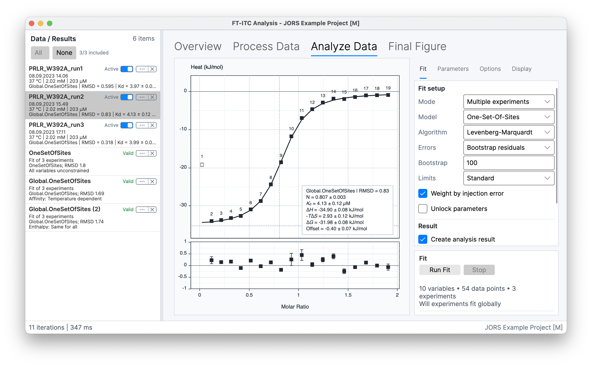
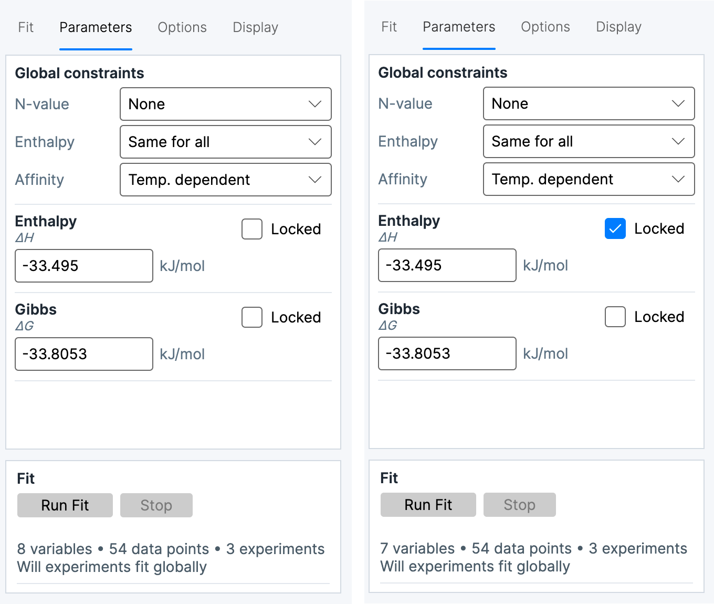

# Multiple-experiment fitting

**Multiple experiments** is the multi-dataset mode in **Analyze Data**. It represents at least two processed **Active** experiments with one shared model context and one combined **Analysis Result**. When every constraint is **None**, the members are fitted independently. When one or more supported constraints are active, the solver performs one connected global optimization. Each experiment remains a member of the result, with member-specific parameters where the constraint state is **None**.

The model and model options apply across the active set. The resulting **Analysis Result** retains the member fits, any shared or temperature-dependent parameters, constraints, solver settings, diagnostics, and uncertainty output. Shared fitting controls are described in [Single-experiment fitting](06-fitting-models.md).

## Fit

The **Fit** tab identifies the **Mode** as **Multiple experiments** and exposes the shared **Model** selection. The solver controls include **Algorithm**, **Errors**, **Bootstrap**, **Limits**, **Weight by injection error**, and **Unlock parameters**. The available **Algorithm** values are **Nelder-Mead** and **Levenberg-Marquardt**; the error-estimation values are **None**, **Bootstrap residuals**, and **Leave-one-out**.

The **Result** controls describe whether a completed fit is stored as an **Analysis Result** and whether that result opens automatically. **Run Fit** and **Stop** are the fit controls. The status area records termination state, RMSD, iteration count, elapsed time, and error-estimation outcome when applicable. A multiple-experiment analysis is ready only when every member has usable processed data and the set contains at least two members.

*A shared enthalpy constraint connects the three Active experiments in one global fit.*

## Parameters

The **Parameters** tab contains the exposed fit parameters and, in multiple-experiment mode, the **Global constraints** section. Parameter rows show the current value, units, uncertainty information when available, and the parameter lock state. A parameter value or lock state is a parameter setting; it is separate from the relationship between members.

The constraint states have these meanings:

| State | Meaning |
| --- | --- |
| **None** | The parameter remains member-specific. Each experiment has its own fitted value. |
| **Same for all** | One common value is fitted for every member in the set. |
| **Temperature dependent** | A supported parameter is represented across the temperature series by the relationship exposed by the model. |

The **Locked** state fixes an exposed parameter at its displayed value during fitting. **Locked** is not a constraint state and does not make a parameter common to the member experiments. A locked global value and a member-specific locked value therefore have different scopes.

For the core binding parameters, the available relationship states are model- and data-dependent:

| Parameter | Available states |
| --- | --- |
| **Affinity** | **None** or **Temperature dependent** |
| **Enthalpy** | **None** or **Same for all**; **Temperature dependent** is also available when the selected set exposes temperature dependence |
| **N-value** | **None** or **Same for all** |

The interface omits unsupported states for the current model. The corresponding labels can appear as **Temp. dependent**, **Independent**, or **Shared**; they describe the same temperature-dependent, member-specific, and common relationships.

> **Calculation:**
>
> *ΔH*(*T*) = *ΔH*ref + *ΔC*p(*T* − *T*ref)
>
> *K*a(*T*) = exp[−*ΔG* / (*R T*)]
>
> *ΔH*ref is the enthalpy at the reference temperature, and *ΔC*p is the common heat-capacity term. Temperature-dependent affinity is represented through a common free-energy term. *T* and *T*ref are absolute temperatures.

## Options

The **Options** tab contains the options exposed by the selected model. In multiple-experiment mode, an option is a property of the shared model context and applies to every member. This includes model-specific concentration, stoichiometry, syringe-correction, or prebound-species settings when those options are exposed. The option values are preserved with the combined Analysis Result.

An option that changes which parameters are exposed can also change the available parameter rows and constraint states. For example, model options that share or replace stoichiometry alter which N-values are independently represented. The available rows always describe the active model and option combination.

## Display

The **Display** tab controls the graph presentation for the active member set. Its controls cover the fitted line, residuals, error bars, confidence band, point labels, parameter box, excluded points, automatic scaling, unified axes, fitted offset, and fit-line interpolation. The parameter box can separately show model, fitted, and derived parameters.

Display settings affect the graph presentation, not the model, the member data, or the fitted values. The graph can therefore show the current member fits or connected global fit alongside member observations while the Parameters tab remains the source of the stored parameter and constraint state.

## Combined Analysis Result

The combined **Analysis Result** contains the exact member experiments, the shared model and options, member parameters, any shared or temperature-dependent parameters, active constraints, solver and weighting settings, convergence diagnostics, and uncertainty results. Its result table can represent both global values and member-specific values. A selected member retains its own fitted curve and residual information even when a parameter is common across the set.

The status and diagnostics distinguish a successful solver termination from the quality and uncertainty of the fit. RMSD, iteration count, weighting, error-estimation method, and the number of successful uncertainty refits describe how the combined result was obtained. Wide or asymmetric uncertainty, a member with a markedly different residual pattern, or a member solution with an invalid status remains visible as member-level information rather than being hidden by a combined value. Result interpretation and validity are covered in [Results and advanced analyses](08-results-advanced-analysis.md).
