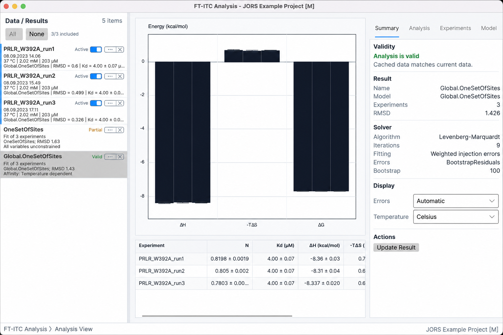
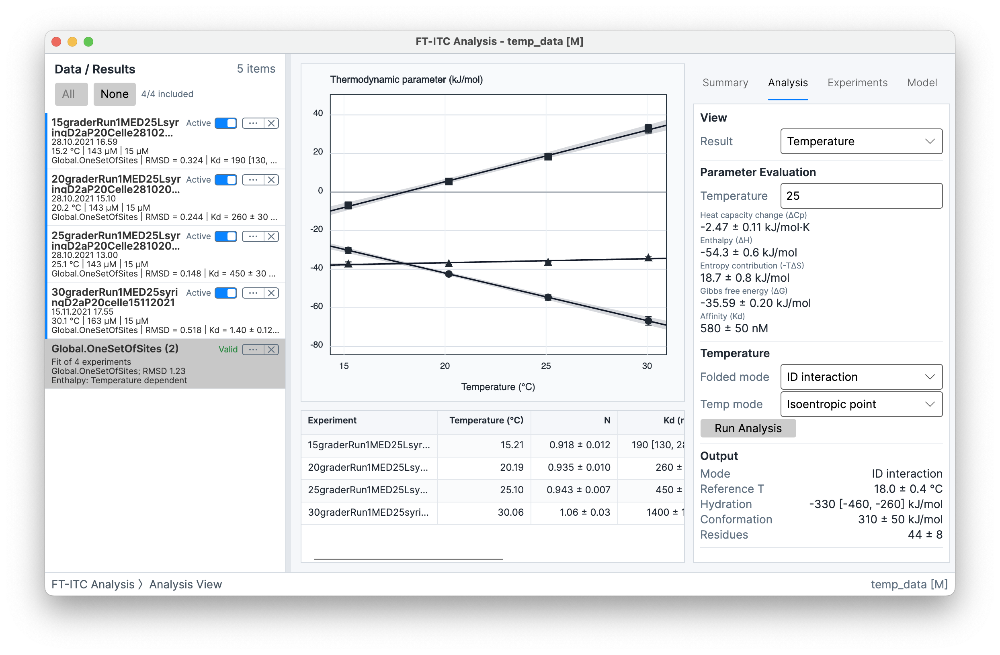

# Results and advanced analyses

An **Analysis Result** is a stored fit for one or more experiments. It contains the model and options, constraints, solver state, weighting and uncertainty settings, member solutions, and a validity snapshot. The result workspace presents those stored values together with graph and analysis views. The fitting controls are described in [Single-experiment fitting](06-fitting-models.md), and multi-dataset constraints are described in [Multiple-experiment fitting](07-multiple-experiments.md).

## Result views

The result view selector contains **Fit**, **Correlation**, and **Summary** for every Analysis Result. Ordinary thermodynamic temperature plots and parameter evaluation can contain every active sequential step. **Temperature** advanced analysis (Spolar Record method), **Salt**, and **Protonation** appear only when the selected model defines those analyses and the member metadata satisfy their additional requirements.

**Summary** presents the combined parameter graph and result table. The table can show fitted values, derived values, and the selected uncertainty representation for each stored solution. Molar-energy columns share one automatically resolved unit (or the fixed unit selected for result export), while ΔCp columns resolve independently. Selecting a row makes that member the current result solution; the selection is retained by the result workspace and drives **Fit** and the local portion of **Correlation**. The result workspace no longer has a separate four-choice energy-prefix menu; use **Preferences > General > Energy units** for the Joules/Calories family.

**Fit** presents the saved fitted curve, residuals, error bars, confidence band, and excluded points for the selected member. The graph is read-only: it represents the stored solution and does not expose fit controls or alter the underlying experiment.

**Correlation** presents a matrix calculated from residual-bootstrap refits. Its availability, scope, and interpretation are described under [Parameter correlation](#parameter-correlation).

## Inspector tabs

The result inspector has four tabs with shared labels across the supported desktop versions: **Summary**, **Analysis**, **Experiments**, and **Model**.

The **Summary** tab contains the result identity, model, member count, RMSD, information criteria, and solver diagnostics. The validity section reports **Analysis is valid**, **Partially invalid**, **Invalid**, or **Unknown status**, with reasons when the stored validity snapshot differs from current member inputs. Solver information includes algorithm, iterations, weighted or unweighted injection errors, error-estimation method, and bootstrap count.

### Information criteria

The **Information criteria** section reports AICc when it is available, otherwise AIC, together with the included observation count *n* and likelihood parameter count *K*. For an unweighted result, *K* includes one estimated common residual-variance parameter. For a weighted result, the injection sigmas are treated as known observation errors and are not counted in *K*. AICc is unavailable when *n* ≤ *K* + 1, in which case AIC is shown instead. If the shared likelihood cannot be evaluated, the displayed criterion shows its diagnostic reason.

The criteria use the saved result's included injections and response definition. Unweighted fits use one Gaussian variance estimated across all members; weighted fits use the existing per-injection sigma selection, including its per-member fallback. With residuals *r*i, raw residual sum of squares *RSS* = Σ*r*i2, and known sigmas *σ*i, the likelihood terms are:

> **Estimated common variance:** −2 log *L* = *n*[log(2π*RSS*/*n*) + 1]
>
> **Known observation sigmas:** −2 log *L* = Σ(*r*i/*σ*i)2 + *n* log(2π) + Σlog(*σ*i2)

The fitted parameter count *p* includes only parameters free in the saved global model. Shared coordinates count once; member-specific coordinates count once per member. The likelihood count is *K* = *p* + 1 for an estimated common variance and *K* = *p* for known sigmas. The reported values are AIC = −2 log *L* + 2*K* and AICc = AIC + 2*K*(*K* + 1)/(*n* − *K* − 1).

Smaller values are preferred only when comparing models that use the same observations, response definition, and weighting mode. AIC and AICc do not establish model adequacy or replace residual and scientific checks. Prefer AICc when it is available.

The **Analysis** tab contains the result view selector, parameter evaluation, and the analysis-specific controls and outputs. It is also the location of the uncertainty display, correlation information, and evaluation-temperature presentation associated with the selected view. Energy labels and values use the family resolver for the visible central-value group, including graph axes, errors, fitted bands, tooltips, and parameter lists.

The **Experiments** tab lists the result members and their stored status and condition information, including member temperature. The member represented as selected in the result table drives **Fit**, while this tab provides the corresponding member context.

The **Model** tab shows the stored model options and the active constraints. A constraint with state **None** is not listed as an active global constraint; **Same for all** and **Temperature dependent** entries identify the relationships retained by the Analysis Result. The corresponding labels **Independent** and **Shared** describe the same member-specific and common relationships.

## Uncertainty and evaluation temperature

The **Errors** display control provides **Automatic**, **Standard deviation**, **95% confidence interval**, and **SD + 95% CI**. **Standard deviation** presents the primary best-fit value with a symmetric ± SD; **95% confidence interval** presents that same best-fit value with the lower and upper percentile limits; and **SD + 95% CI** presents both. The central value is always the primary best fit, not the mean or median of the resampled values.

**Automatic** makes this choice separately for each reported quantity. Let *L* and *U* be its stored 95% confidence limits and *θ̂* its primary best-fit value:

> **Calculation:**
>
> *w*lower = *θ̂* − *L*; *w*upper = *U* − *θ̂*
>
> asymmetry = |*w*upper − *w*lower| / (*w*upper + *w*lower)
>
> Automatic shows the 95% confidence interval when both widths are positive and the asymmetry is at least 0.18; otherwise it shows SD. This is a display rule based on interval imbalance around the best fit, not a formal statistical test of distribution skewness.

The decision is made after a fitted coordinate has been transformed into the displayed quantity. A nonlinear transformation—such as fitting log10(*K*a) and displaying *K*d—can therefore make the displayed interval asymmetric and cause **Automatic** to select CI for that quantity.

Changing **Errors** changes only how stored uncertainty is presented in tables, parameter evaluation, and graphs. It does not rerun the fit, change the best-fit parameters, or turn one error-estimation method into another. Bootstrap construction, parameter transformation, and the SD and percentile calculations are described under [Parameter uncertainty](06-fitting-models.md#parameter-uncertainty).

The **Parameter Evaluation** section contains an evaluation **Temperature** field and the displayed thermodynamic quantities at that temperature. Temperature display can be **Celsius** or **Kelvin**. Changing the evaluation temperature changes derived presentation from the stored model; it does not change injection heats or refit the result. Temperature-dependent values are meaningful together with their model, units, uncertainty representation, and evaluation temperature.

## Parameter correlation

**Correlation** shows Pearson correlations between fitted parameter coordinates across residual-bootstrap refits. It requires **Bootstrap residuals**, at least 30 complete refits, and at least two parameters that vary across those refits. Parameters with no variation are omitted. Parameters fixed in the primary fit are also omitted unless **Unlock parameters** allowed them to vary during bootstrap error estimation; such parameters are marked with an asterisk and a warning that bootstrap parameter unlocking was enabled.

> **Calculation:**
>
> *r*jk = Σb[(*θ*bj − *θ̄*j)(*θ*bk − *θ̄*k)] / √[Σb(*θ*bj − *θ̄*j)2 Σb(*θ*bk − *θ̄*k)2]
>
> *r*jk is the Pearson correlation between fitted coordinates *j* and *k*. The index *b* runs over complete residual-bootstrap refits, and *θ̄* is the corresponding mean coordinate.

Matrix values range from −1 to +1. Pointing to a cell shows *r*, the number of bootstrap refits used, and the application's weak, moderate, or strong description. For a single-experiment result, the scope is **Single experiment**. A multiple-experiment result can show **Shared** coordinates alone or **Shared + selected local** coordinates when a member is selected. Shared and local labels identify the scope of each parameter.

Sequential correlations use the actual fitted coordinates. Affinity coordinates
are labeled **log10 Ka1** through **log10 Ka4**, active enthalpy coordinates are
included, and no N-value coordinate is added. A global result shows the shared
per-step coordinates and, when requested, unconstrained coordinates for the
selected member without duplicating constrained member values.

> **Interpretation:** Correlation shows how fitted coordinates varied together under the residual bootstrap. It is not an uncertainty estimate, proof of parameter identifiability, or evidence that one parameter causes another. Affinity is evaluated in the fitted coordinate system—log10(*K*a)—rather than as the displayed *K*d. A rank warning indicates that the available bootstrap refits do not provide full covariance rank for the displayed parameter count.

## Advanced analysis views

All advanced analyses require a **One-Set-Of-Sites** Analysis Result. Availability is additionally conditional on the relevant condition span and metadata. The advanced analyses operate on the stored member solutions and expose their own calculated outputs; they do not change the base fit parameters. A sequential result can still show its ordinary per-step ΔH, ΔG, −TΔS, Kd, and temperature-dependence presentation; it reports the Spolar Record method, protonation, and electrostatics as unsupported by that model rather than hiding the ordinary thermodynamic views.

### Temperature

The **Temperature** view is available when member temperatures span more than the configured minimum temperature span. Its temperature-analysis controls expose **Folded mode** values **Globular** and **ID interaction**, together with **Temp mode** values **Isoentropic point**, **Mean temperature**, and **Reference temperature**.

The stored temperature-analysis output includes reference temperature, hydration contribution, conformational contribution, and residue estimate. These values describe the selected folded and temperature-evaluation modes under the fitted temperature dependence. They remain conditional estimates of the stored model and member series rather than direct structural measurements.

### Salt

The **Salt** view requires a **Salt** attribute for every member and sufficient ionic-strength span across the member set. Its **Graph mode** values are **Affinity vs Salt**, **Debye-Huckel**, and **Counter Ion Release**. Counter-ion release is a salt analysis mode and is presented in the Salt view rather than as a separate advanced analysis.

The Salt output includes the extrapolated **Kd0** and **Counter ion** result when the analysis has a calculated fit. The graph mode determines whether the displayed dependence is expressed against salt, ionic strength using Debye-Huckel behavior, or ion activity for counter-ion release. The result is limited by the recorded salt identities, ionic-strength values, and the quality and span of the member affinity values.

> **Calculation:**
>
> ln *K*d(*I*) = ln *K*d,0 + *s*√*I*
>
> ln *K*d = *b* + *n*ion ln *a*ion
>
> *I* is ionic strength, *s* is the fitted sensitivity, *a*ion is ion activity, and *b* is the fitted intercept. *K*d,0 is the extrapolated value in the Debye–Hückel view. *n*ion is the reported slope for Counter Ion Release; its sign is reported by the analysis and is not assigned an interpretation here.

### Protonation

The **Protonation** view requires a **Buffer** attribute for every member and at least two distinct buffer identities. Its calculated output contains **Protons** and **Binding H**, with uncertainty when the stored analysis contains the corresponding uncertainty results.

The view relates the stored member binding enthalpies to the buffer protonation information associated with their conditions. The result is conditional on the recorded buffer identities, their temperature-dependent protonation enthalpies, and the model assumptions; it does not identify a particular residue or microscopic protonation event.

> **Calculation:**
>
> *ΔH*obs = *ΔH*bind + *m* *ΔH*buffer
>
> The fitted slope is *m*. The application reports **Protons** as −*m*, while **Binding H** is the fitted intercept at zero buffer protonation enthalpy. This sign convention follows the application's protonation-enthalpy convention; it does not by itself assign a microscopic uptake or release mechanism.

Advanced-analysis values are supplemental views of a stored Analysis Result. Their availability and outputs are determined by the One-Set-Of-Sites model, member variation, metadata, selected graph or evaluation mode, and any completed uncertainty calculation. Result validity remains a separate indication of whether the stored fit inputs match the current project state. Figure and table output is covered in [Figures and export](09-figures-printing-export.md).
