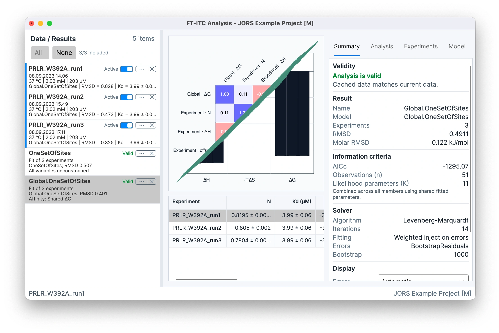
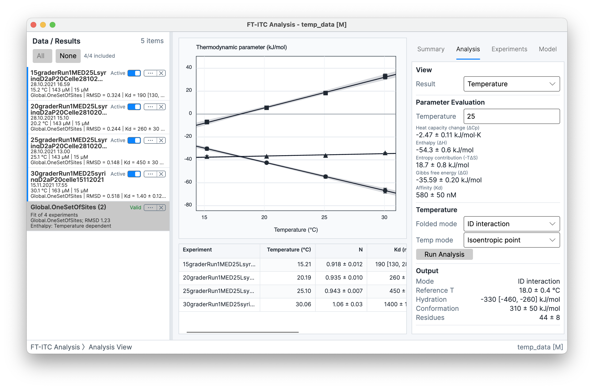

# Results and advanced analyses

An **Analysis Result** saves a fit so you can inspect and export it later. Start with the fitted values and graph, then check where the predicted heats differ from the measured heats. The uncertainty display describes how precisely the parameters were estimated under the chosen model; the validity indicator tells you whether the saved fit still matches the experiment data currently in the project.

The result stores the model and options, constraints, solver state, weighting and uncertainty settings, member solutions, and a validity snapshot. The result workspace presents those values together with graph and analysis views. The fitting controls are described in [Single-experiment fitting](06-fitting-models.md), and multi-dataset constraints are described in [Multiple-experiment fitting](07-multiple-experiments.md).

## Result views

The result view selector contains **Fit**, **Correlation**, and **Summary** for every Analysis Result. Thermodynamic temperature plots and parameter evaluation can show every active step in a sequential binding model. **Temperature** (temperature dependence and structuring), **Salt**, and **Protonation** appear only when the selected model defines those analyses and the member metadata satisfy their additional requirements.

**Summary** presents the combined parameter graph and result table. The table can show fitted values, derived values, and the selected uncertainty representation for each stored solution.

Molar-energy values use a common displayed unit; ΔCp can use a different unit.

Select a member row to view its **Fit** and available **Correlation** information. Use **Preferences > General > Energy units** to choose joules or calories.

Advanced analyses can sample the stored values and uncertainty summaries from profile-likelihood results. This does not provide a bootstrap ensemble or a joint model of parameter covariance. Saved leave-one-out refits can provide an envelope on the integrated-heats graph.

**Fit** presents the saved fitted curve, residuals, error bars, confidence band, and excluded points for the selected member. The graph is read-only: it represents the stored solution and does not expose fit controls or alter the underlying experiment.

**Correlation** presents a matrix calculated from residual-bootstrap refits. Its availability, scope, and interpretation are described under [Parameter correlation](#parameter-correlation).

## Result details

Open a saved result's details to edit its name and comments and inspect its saved fit information. On native macOS, **Result Details** opens as a sheet with three tabs:

- **Details** contains the name, read-only date, saved **Analysis operator**, comments, and a summary of the model, fit metrics, solver, uncertainty settings, and validity reasons.
- **Experiments** lists the result's member experiments, including their dates, temperatures, and solution status.
- **Actions** provides **Copy result table**, **Load solutions to experiments**, and **Select result experiments**. Selection includes the experiments belonging to this result and excludes the others in the current project. Copying uses the preferred energy-unit family and temperatures in Celsius.

**Apply** saves a nonblank name and the comments; **Cancel** discards those pending edits.

The saved **Analysis operator** records the operator associated with the fit when the result was created or last successfully updated. Results without a saved name show **Not recorded**.

## Inspector tabs

The result inspector has four tabs with shared labels across the supported desktop versions: **Summary**, **Analysis**, **Experiments**, and **Model**.

The **Summary** tab contains the result identity, model, member count, RMSD, validity, information criteria, and solver diagnostics. Solver information includes algorithm, iterations, whether injection-error weighting was used, error-estimation method, and bootstrap count.

In the browser viewer, RMSD is shown as a saved unweighted display diagnostic in µJ, separate from the weighted fitting objective. When the saved convergence record contains it, **Molar RMSD (kJ/mol)** is shown separately: the result summary uses the saved global metric, while an individual fit uses that fit's saved metric. Missing or non-finite saved values remain unavailable; member values are not averaged to reconstruct the result metric.

### Result validity

Validity answers whether the saved fit still describes the experiment inputs currently in the project. FT-ITC compares the result's saved inputs with the current member experiments, including their concentrations, cell volume, injection bookkeeping, included injections and heats, relevant processing and attributes, and tandem segment layout. Changing a result name or attaching a different solution to an experiment does not by itself change this status. Validity does not say whether the model is scientifically appropriate or the fit is good.

- **Analysis is valid** means the saved fit inputs still match.
- **Partially invalid** means some members of a multiple-experiment result fitted independently have changed, while others still match. A shared-parameter fit is treated as invalid when any member changes.
- **Invalid** means the saved fit no longer matches the current inputs, or the set of member experiments has changed.
- **Unknown status** means FT-ITC cannot make the comparison, for example because an older result has no validity snapshot.

The status section combines input-validity reasons with analysis warnings. **Warning** can identify a fitted parameter at a boundary, limits reached during uncertainty estimation, or an effectively **Inconclusive** member. These warnings do not change input validity. A manual **Binding detected** assessment clears the Inconclusive warning for that member; other warnings remain. Boundary and uncertainty-limit warnings from an experiment assessed as **No binding detected** do not count toward the result status, because its fitted parameters are not expected to be meaningful; they are still listed with that experiment. The validity section gives reasons for a mismatch. Repeated desktop reasons affecting more than two experiments are summarized by category and count. If inputs changed, inspect those reasons and use **Update Result** to fit the current data. Until then, the stored parameters still describe the earlier inputs. In the browser viewer, **Saved result has analysis warnings** is separate from validity: it flags issues such as a fit reaching a parameter boundary or an optimizer limit, even when the saved inputs still match.

### Information criteria

**AIC** and **AICc** help compare candidate models fitted to the same observations. They balance agreement with the data against the number of fitted parameters; a smaller value is preferred within a comparable set. They do not tell you that any model is scientifically correct.

The **Information criteria** section reports the analysis-level AICc when it is available, otherwise AIC, together with the included observation count *n* and likelihood parameter count *K*. Both weighted and unweighted criteria estimate one residual-variance parameter, so *K* = *p* + 1, where *p* is the number of free fitted parameters. Weighted criteria use the injection integration errors as relative uncertainties and estimate one common variance multiplier from the standardized residuals. AICc is unavailable when *n* ≤ *K* + 1, in which case AIC is shown instead. If the likelihood cannot be evaluated, the displayed criterion shows its diagnostic reason.

When members were fitted independently, the result table also includes an **AICc / AIC** column. It reports each member's own criterion and is intended for comparing alternative models fitted to the same experiment, observations, response definition, and weighting mode. Values in different experiment rows are not comparable because they use different observations. AICc is shown when available, with AIC as the fallback when the small-sample correction is undefined; **Unavailable** means that the member likelihood could not be evaluated. Shared-parameter global fits expose only the analysis-level criterion and omit this member column. Neither AIC nor AICc establishes model adequacy.

The criteria use the saved result's included injections and response definition. At analysis level, residual statistics are pooled before estimating the variance, including when members were fitted independently. Unweighted criteria estimate one common variance across all members; weighted criteria estimate one common multiplier of the injection-error variances. Each independent member's own criterion estimates its variance separately. Consequently, neither pooled AIC nor pooled AICc is a sum of the member values.

With residuals *r*i, raw residual sum of squares *RSS* = Σ*r*i2, integration-error SDs *σ*i, and standardized residual sum of squares *Q* = Σ(*r*i/*σ*i)2, the maximized likelihood terms are:

For an **unweighted fit with one estimated common variance**:

> **Calculation:**
>
> −2 log *L* = *n*[log(2π*RSS*/*n*) + 1]
>
> This estimates one shared residual variance from the total squared mismatch *RSS*, then scores how likely the observed heats are under that estimate.

For a **weighted fit with one estimated variance multiplier**:

> **Calculation:**
>
> −2 log *L* = *n*[log(2π*Q*/*n*) + 1] + Σlog(*σ*i2)
>
> This uses each injection's processing SD *σ* as a relative weight. The score also includes their different uncertainty scales.

Weighted criteria use the processing SDs as relative measures of injection uncertainty and estimate one common variance multiplier, *Q*/*n*, from the standardized residual score *Q* and observation count *n*. This does not change those SDs or the fitted parameters. Every included injection needs a positive SD for weighted fitting. A score is unavailable when residual variance is zero. Weighted profile-likelihood intervals retain the relative weights and use the estimated overall residual scale for their threshold.

The fitted parameter count *p* includes only parameters free in the saved global model. Shared coordinates count once; member-specific coordinates count once per member. For a member criterion, *p* includes only that member model's free fitted parameters. In both weighting modes, the reported values use *K* = *p* + 1, AIC = −2 log *L* + 2*K*, and AICc = AIC + 2*K*(*K* + 1)/(*n* − *K* − 1). This standard small-sample correction is an approximation for nonlinear ITC models.

Smaller values are preferred only when comparing models that use the same observations, response definition, and weighting mode. AIC and AICc do not establish model adequacy or replace residual and scientific checks. Prefer AICc when it is available.

### Null hypothesis test

A null hypothesis is the simplest explanation of the data that you want to rule out before trusting a more detailed model. For a titration, the null hypothesis is that every injection releases only a constant background heat from dilution and mixing, with no binding. If a binding model does not describe the data clearly better than this background alone, its fitted affinity, enthalpy, and stoichiometry are not supported by the data.

The comparison uses the Offset model, which predicts each injection heat as *q*i = *b m*i, where *m*i is the amount injected and *b* is a constant background heat per mole of injectant. It uses the same included injections and weighting as the binding fit. The analysis inspector shows the automatic conclusion; use **Modify Assessment** on the saved result to change it manually or return to automatic assessment. The Summary shows the Null model RMSD and the signed ΔAICc. **Null prediction** overlays the model fit on the integrated-heats graph; the original binding fit remains available. In the native macOS Analysis view, choose **Show Null Prediction** from the **Analysis** menu on the right side of the toolbar.

For multi-experiment results, the Null model value is fitted separately for each experiment using the ordinary single-experiment fit. A locked or shared binding-model does not constrain these local Null model fits. For independently fitted binding models, each local comparison determines its member assessment. For pooled shared-parameter binding fits, all local null fits are combined under the pooled variance convention to calculate the result-level comparison.

The two fits are compared with AICc (see [Information criteria](#information-criteria)), which balances fit quality against the number of fitted parameters:

> **Calculation:**
>
> ΔAICc = AICcnull − AICcbinding
>
> A positive value favors binding because the Null model has the higher AICc. It does not establish that the selected binding model is adequate or correct. A negative ∆AICc value indicates that the Null model is favored.

The automatic assessment is **No binding detected** at negative ΔAICc, **Inconclusive** when 0 < ΔAICc < 10, and **Binding detected** when ΔAICc is above 10. These are chosen cutoffs and have no calibrated false-positive guarantee. **No binding detected** means the data does not establish binding relative to the selected Null model; it does not establish that the molecules cannot bind. Use **Modify Assessment** to mark a manual conclusion or restore automatic assessment. A successful result update recalculates automatic outcomes and clears affected manual overrides. Saved assessments retain their original outcome and rule when reopened; refitting applies the current rule. Comparisons and assessments are saved in `.ftxtc` projects; older single-experiment and pooled results are initialized from saved evidence when available. For independent collections, a missing member record leaves that member Not assessed.

For an independently fitted collection, each experiment has its own binding assessment. The **Member assessments** summary shows their common assessment when all members agree, or **Mixed assessments** when they differ, including differences involving Inconclusive. It uses each member’s effective assessment, including manual overrides. The summary describes the collection rather than a joint statistical verdict; counts show how its members are assessed. Inconclusive members retain their fitted values and uncertainty, with the assessment visible. Combined binding summaries are shown only when every member is Binding detected, Inconclusive, or Not assessed. If any member is effectively No binding detected, the report names those members and omits combined binding values and dependent analyses. A pooled comparison across independent fits is diagnostic evidence only; it does not determine member assessments. For a pooled binding fit, one result-level assessment applies to the combined fit.

Analysis reports and result-table exports offer Standard output and a Diagnostic option. Reports retain the model, options, fitting scope, constraints, fixed values, and fit details for every assessment mix. In Standard reports, the parameter overview lists every member but leaves the parameter and RMSD cells of **No binding detected** members blank; their experiment chapters omit the parameter table, RMSD, c-values, and parameter correlations, and the report warnings omit their fit warnings. **No binding detected** and **Inconclusive** appear under the experiment name; other outcomes are not labelled there. Unavailable estimates appear as **—**, which differs from a blank cell. Standard member figures use the applicable fitted Offset. Manual overrides are marked **(manual)** in each experiment's fit details, and everywhere in the report when Traceability Mode is on. Thermodynamic summary plots omit no-binding members in both Standard and Diagnostic reports, identify the omitted members, and are absent if none remain. **Inconclusive** members retain binding-model output with their assessment.

Standard result-table exports continue to omit no-binding members' binding values and RMSD, while keeping their ionic strength and protonation enthalpy; Inconclusive values are included. **Diagnostic report** and **Diagnostic export** retain available attempted binding detail, including every member's estimates, labels, and fit warnings, and full comparison evidence. Diagnostic reports place pooled comparison evidence for independent collections in **Pooled Comparison Diagnostics**; Diagnostic Summary exports place it in separately labelled pooled-diagnostic columns. This evidence uses a pooled variance convention and does not determine member assessments.

The **Analysis** tab contains the result view selector, parameter evaluation, and the analysis-specific controls and outputs. It is also the location of the uncertainty display, correlation information, and evaluation-temperature presentation associated with the selected view. Energy units are chosen consistently from the displayed central values and are also used for graph axes, errors, fitted bands, tooltips, and parameter lists.

The **Experiments** tab lists the result members and their stored status and condition information, including member temperature. The row selected in the result table determines which experiment appears in **Fit**; this tab provides that experiment's details.

The **Model** tab shows the stored model options, locked parameters and their fixed values, and the active constraints. Constraints with state **Independent** are not listed as active global constraints. Affinity constraints are labelled **Independent**, **Shared Kd**, **Shared ΔG**, or **Thermodynamically linked** to describe the fitted relationship precisely; other parameters use **Shared** and, where supported, **Temperature dependent**.

## Uncertainty and evaluation temperature

The central value is the model's best fit to the original data. An uncertainty display gives a range or spread around that value under the selected estimation method. It does not include every possible experimental error or guarantee that the chosen model is correct.

The **Errors** display control provides **Automatic**, **Standard deviation**, **95% confidence interval**, and **SD + 95% CI**. **Standard deviation** presents the primary best-fit value with a symmetric ± SD; **95% confidence interval** presents that same best-fit value with its lower and upper confidence limits; and **SD + 95% CI** presents both. The central value is always the primary best fit, not the mean or median of the resampled values. Residual-bootstrap intervals use percentile limits; profile-likelihood intervals use the likelihood-threshold endpoints, with an equivalent symmetric scale for the SD display.

**Automatic** makes this choice separately for each reported quantity. Let *L* and *U* be its stored 95% confidence limits and *θ̂* its primary best-fit value:

> **Calculation:**
>
> *w*lower = *θ̂* − *L*; *w*upper = *U* − *θ̂*
>
> asymmetry = |*w*upper − *w*lower| / (*w*upper + *w*lower)
>
> Automatic shows the 95% confidence interval when both widths are positive and the asymmetry is at least 0.18; otherwise it shows SD. This is a display rule based on interval imbalance around the best fit, not a formal statistical test of distribution skewness.

The decision is made after a fitted coordinate has been transformed into the displayed quantity. A nonlinear transformation—such as fitting log10(*K*a) and displaying *K*d—can therefore make the displayed interval asymmetric and cause **Automatic** to select CI for that quantity.

Changing **Errors** changes only how stored uncertainty is presented in tables, parameter evaluation, and graphs. It does not rerun the fit, change the best-fit parameters, or turn one error-estimation method into another. Bootstrap construction, parameter transformation, and the SD and percentile calculations are described under [Parameter uncertainty](06-fitting-models.md#parameter-uncertainty).

The **Parameter Evaluation** section contains an evaluation **Temperature** field and the displayed thermodynamic quantities at that temperature. Temperature display can be **Celsius** or **Kelvin**. Changing the evaluation temperature updates the displayed quantities calculated from the stored model; it does not change injection heats or refit the result. Temperature-dependent values are meaningful together with their model, units, uncertainty representation, and evaluation temperature.

For locally fitted member parameters, summary values include individual parameter uncertainty. **Combined SD** is the square root of the between-experiment sample variance plus the mean individual variance; temperature trends use residual variance in place of sample variance. It describes combined spread, not the standard error of the mean, and observed spread may already contain fitting noise. **Approximate propagated interval** targets the average or evaluated trend: individual lower and upper 95% interval widths are propagated separately and combined with the observed-spread contribution. The best-fit central values remain unchanged, and asymmetric intervals can remain asymmetric. Exactly two observations at distinct temperatures propagate individual errors without estimating residual variance; additional observations, including replicates at those same temperatures, contribute residual spread. ΔCp propagates the corresponding slope uncertainty. These intervals do not have established 95% coverage, especially with few experiments, and covariance between experiments is omitted even for local parameters coupled through a global fit. Shared and temperature-constrained parameters retain their model-estimated uncertainty and CI95 meaning.

## Parameter correlation

This view shows whether two fitted parameters tend to move together when the data are resampled. A strong relationship can mean that the data have difficulty separating their effects, but the display alone cannot establish why.

**Correlation** shows Pearson correlations between fitted parameter coordinates across residual-bootstrap refits. It requires **Bootstrap residuals**, at least 30 complete refits, and at least two parameters that vary across those refits. Parameters with no variation are omitted. Parameters fixed in the primary fit are also omitted unless **Unlock parameters** allowed them to vary during bootstrap error estimation; such parameters are marked with an asterisk and a warning that bootstrap parameter unlocking was enabled.

> **Calculation:**
>
> *r*jk = Σb[(*θ*bj − *θ̄*j)(*θ*bk − *θ̄*k)] / √[Σb(*θ*bj − *θ̄*j)2 Σb(*θ*bk − *θ̄*k)2]
>
> *r*jk is the Pearson correlation between fitted coordinates *j* and *k*. The index *b* runs over complete residual-bootstrap refits, and *θ̄* is the corresponding mean coordinate.

For each off-diagonal cell, the application also reports an approximate 95% Monte Carlo precision interval using Fisher's transformation:

> **Calculation:**
>
> *z* = atanh(*r*),   *z*± = *z* ± 1.959964 / √(*B* − 3),   *r*± = tanh(*z*±)
>
> *B* is the number of complete refits: usable refits with finite values for every displayed coordinate. The diagonal is the structural self-correlation *r* = 1 and has no Fisher precision interval.

Matrix values range from −1 to +1. Pointing to a cell shows *r* and the Monte Carlo precision interval; an interval spanning zero marks the sign as unresolved at the current simulation precision. The result panel separately reports attempted, usable, failed, and complete refits. It warns when fewer than 100 complete refits make precision coarse, at least 20% of attempted refits failed, a usable refit lacked a finite displayed coordinate, a sign is unresolved, or the matrix is structurally rank limited. The correlation matrix remains unavailable below 30 complete refits. For a single-experiment result, the scope is **Single experiment**. When experiments were fitted independently, select a member to view its **Single experiment** correlations; the matrix, precision intervals, refit counts, and warnings use that member's own refits. Another member's bootstrap count does not limit them. A jointly fitted multiple-experiment result can show **Shared** coordinates alone or **Shared + selected local** coordinates when a member is selected. Shared and local labels identify the scope of each parameter.

Sequential correlations use the actual fitted coordinates. Affinity coordinates
are labeled **log10 Ka1** through **log10 Ka4**, active enthalpy coordinates are
included, and no N-value coordinate is added. A global result shows the shared
per-step coordinates and, when requested, unconstrained coordinates for the
selected member without duplicating constrained member values.

> **Interpretation:** Correlation shows how fitted coordinates varied together under the residual bootstrap. The Fisher interval describes the finite-bootstrap Monte Carlo precision of the correlation coefficient *r* itself; it is not a confidence interval for either fitted parameter and does not replace the parameter uncertainty display. It does not establish identifiability, causality, model adequacy, or model validity. An interval spanning zero means only that the sign is unresolved at this Monte Carlo precision. Frequent refit failures can make the retained ensemble selective, and the Fisher interval does not account for those failures. Affinity is evaluated in the fitted coordinate system—log10(*K*a)—rather than as the displayed *K*d. A rank warning states the structural limit *rank* ≤ *B* − 1 for the displayed parameter count; it is distinct from numerical rank and scientific model validity.

## Advanced analysis views

These views ask how a fitted interaction changes with experimental conditions. **Temperature** examines a series measured at different temperatures, **Salt** examines a series with different salt conditions, and **Protonation** compares experiments in different buffers. Their conclusions depend on the recorded conditions and the underlying fit.

All advanced analyses require a **One-Set-Of-Sites** Analysis Result. Each analysis also requires the relevant variation in experimental conditions and the corresponding metadata. The advanced analyses operate on the stored member solutions and expose their own calculated outputs; they do not change the base fit parameters. A sequential result can still show its ordinary per-step ΔH, ΔG, −TΔS, Kd, and temperature-dependence presentation; it reports structuring, protonation, and electrostatics as unsupported by that model rather than hiding the ordinary thermodynamic views.

### Temperature

The **Temperature** view is available when the difference between the highest and lowest member temperatures exceeds the configured minimum span. Its **Structuring** section uses the Spolar–Record method to estimate the hydration entropy (−TΔS_HE), the conformational entropy (−TΔS_conf), and the number of residues folding upon binding. **Interaction** selects **Folded–folded** for two folded proteins or **Folded–disordered** for one folded and one disordered protein. **Evaluated at** selects **Isoentropic point**, **Mean temperature**, or **Reference temperature**. The published method uses the isoentropic point, where ΔS = 0; the mean and reference temperatures are FT-ITC additions. These are model-based estimates, not direct structural measurements. For a thermodynamically linked result, the isoentropic temperature is derived from the complete Gibbs, enthalpy, and heat-capacity relationship. Profile intervals are propagated approximately and omit fitted-coordinate correlations; bootstrap and leave-one-out uncertainty evaluates each saved relationship jointly, while the Spolar–Record Monte Carlo samples its linked inputs independently. Completed structuring outputs retain the temperature used for the run; in Reference temperature mode, rerun the analysis to use a changed reference temperature.

The stored temperature-analysis output includes reference temperature, hydration contribution, conformational contribution, and residue estimate. These values describe the selected folded and temperature-evaluation modes under the fitted temperature dependence. They remain conditional estimates of the stored model and member series rather than direct structural measurements.

### Salt

The **Salt** view requires a **Salt** attribute for every member and sufficient ionic-strength span across the member set. Its **Graph mode** values are **Affinity vs Salt**, **Debye-Huckel**, and **Counter Ion Release**. Counter-ion release is a salt analysis mode and is presented in the Salt view rather than as a separate advanced analysis.

The Salt output includes the extrapolated **Kd0** and **Counter ion** result when the analysis has a calculated fit. The graph mode determines whether the displayed dependence is expressed against salt, ionic strength using Debye-Huckel behavior, or ion activity for counter-ion release. The result is limited by the recorded salt identities, ionic-strength values, and the quality and span of the member affinity values.

> **Calculation:**
>
> ln *K*d(*I*) = ln *K*d,0 + *s*√*I*
>
> ln *K*d = *b* + *n*ion ln *a*ion
>
> *I* is ionic strength, *s* is the fitted sensitivity, *a*ion is ion activity, and *b* is the fitted intercept. *K*d,0 is the extrapolated value in the Debye–Hückel view. *n*ion is the reported slope for Counter Ion Release; its sign is reported by the analysis and is not assigned an interpretation here.

### Protonation

The **Protonation** view requires a **Buffer** attribute for every member and at least two distinct buffer identities. Its calculated output contains **Protons** and **Binding H**, with uncertainty when the stored analysis contains the corresponding uncertainty results.

The view relates the stored member binding enthalpies to the buffer protonation information associated with their conditions. The result is conditional on the recorded buffer identities, their temperature-dependent protonation enthalpies, and the model assumptions; it does not identify a particular residue or microscopic protonation event.

> **Calculation:**
>
> *ΔH*obs = *ΔH*bind + *m* *ΔH*buffer
>
> The fitted slope is *m*. The application reports **Protons** as −*m*, while **Binding H** is the fitted intercept at zero buffer protonation enthalpy. This sign convention follows the application's protonation-enthalpy convention; it does not by itself assign a microscopic uptake or release mechanism.

Advanced-analysis values are supplemental views of a stored Analysis Result. Their availability and outputs are determined by the One-Set-Of-Sites model, member variation, metadata, selected graph or evaluation mode, and any completed uncertainty calculation. Result validity remains a separate indication of whether the stored fit inputs match the current project state. Figure and table output is covered in [Figures and export](09-figures-printing-export.md).

The buffer registry contains approximations and some unknown quantities, so
confirm that the chosen buffer values apply to the experiment. The TAPSO pKa
temperature correction is a local approximation for 20–30 °C. Its protonated
zwitterion is neutral, and imidazole's ionization heat-capacity slope is
−9 J/(mol K). Recalculate affected derived analyses when comparing with results
produced before these corrections.

When **Include buffer in ionic-strength calculation** is enabled, each buffer is corrected using only its own contribution and the transition whose pKa is nearest the recorded pH. The estimate treats that transition as two species and assumes monovalent counterions from acid/base adjustment; salt and other buffer contributions are added separately. This is an approximation, and numerical convergence does not establish chemical accuracy at high buffer concentrations.
