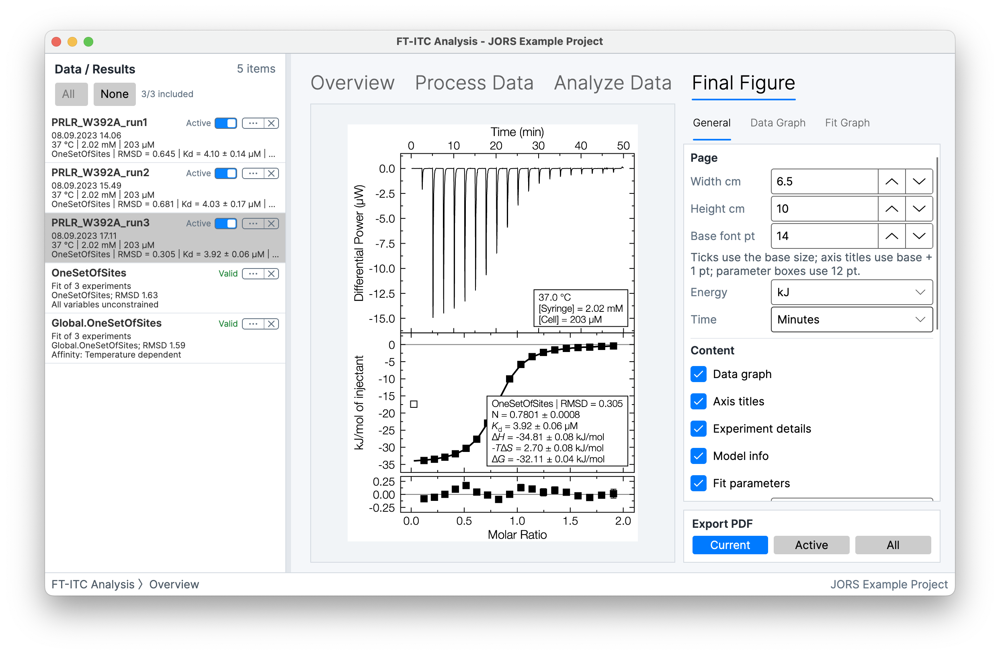
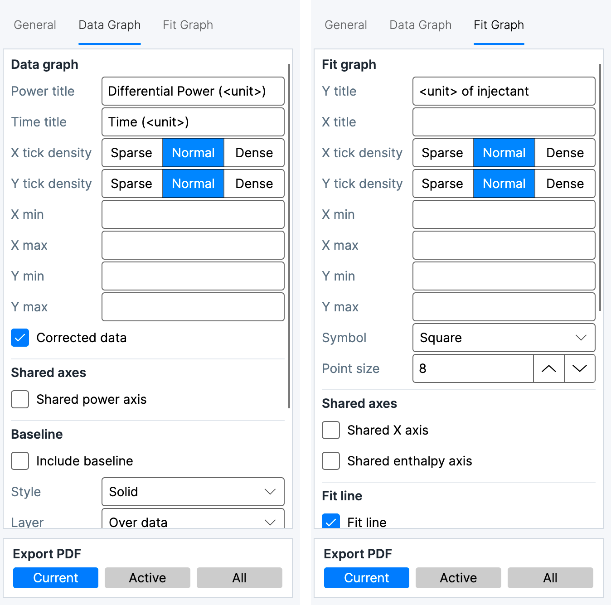
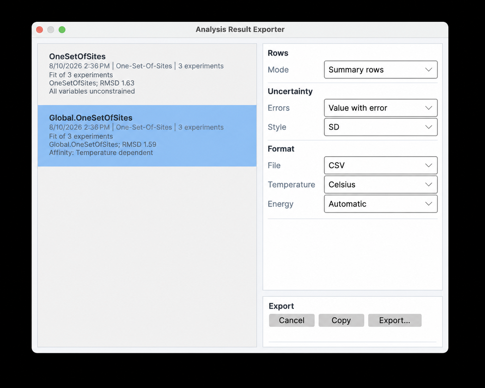
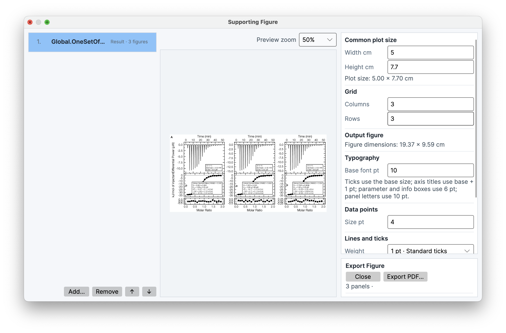

# Figures and export

FT-ITC Analysis keeps publication figures, numerical data, and fitted result tables as separate output types. **Final Figure** is an Experiment Data workflow. An Analysis Result does not open directly as a Final Figure; **Export Associated Final Figures...** on a result exports figures for the experiment solutions associated with that result.

## Final Figure

The **Final Figure** workspace renders the selected Experiment Data as a publication figure. Its preview and PDF output reflect the selected experiment, processing state, fitted solution, and figure options. An Analysis Result can supply fitted solutions for associated figure export, but the result itself is not the Final Figure workspace input.

The Export PDF controls contain three scopes:

- **Current** exports the displayed experiment figure to one PDF.
- **Active** exports figures for Active Experiment Data.
- **All** exports figures for all Experiment Data in the project.

The result-list command **Export Associated Final Figures...** loads the result’s member solutions into their experiments and writes one final-figure PDF per associated experiment. It is available for a result with exportable solutions. See [Results and advanced analyses](08-results-advanced-analysis.md) for result validity and stored member-solution behavior.

### General

The **General** tab defines the page and common content. Page controls specify width and height in centimeters and the base font size. The **Energy units** selector provides **Automatic**, **J**, **kJ**, **cal**, and **kcal**. **Automatic** resolves one normal molar-energy unit from the figure's central plotted/result values; a fixed choice applies to all normal energy values. The selected family also controls thermogram units: differential power is **µW** or **µcal/s**, while integrated heat is **µJ** or **µcal**. Time controls set the displayed time unit. Content controls include the data graph, axis titles, experiment details, model information, fit parameters, and the information-box placement. The uncertainty selector provides **Automatic**, **SD**, **CI**, **SD + CI**, and **None**. **Automatic** uses the same per-quantity asymmetry rule described under [Uncertainty and evaluation temperature](08-results-advanced-analysis.md#uncertainty-and-evaluation-temperature).

The parameter controls determine which information appears in the information box: thermodynamic, derived, or offset parameters; temperature; concentrations; injection delay; instrument; and user-defined attributes. The information box is descriptive figure content and does not alter the underlying fit.

### Data Graph

The **Data Graph** tab controls the differential-power trace. Power and time axis titles, tick density, and explicit minimum and maximum values define the axes. **Corrected data** selects the baseline-corrected trace when one is available. **Shared power axis** applies one power-axis range across the active experiments represented by a figure set.

Baseline controls expose the baseline, its **Solid** or **Dashed** style, **Under data** or **Over data** layer, and line width. **Integration ranges** displays the integration intervals as **Bar**, **Fill**, or **Endpoint lines**. These overlays describe processing and do not recalculate integration.

### Fit Graph

The **Fit Graph** tab controls the integrated-heats and model panels. Enthalpy and molar-ratio axis titles, tick density, and explicit ranges define the axes. Symbols are **Square** or **Circle**, with an independent point size. **Shared X axis** and **Shared enthalpy axis** unify the corresponding ranges across active experiments; the residual-axis range follows the shared enthalpy setting when configured for unified residual axes.

**Fit line** displays the fitted binding curve with a selected width and **Smooth**, **Spline**, or **Linear** smoothness. **Show residuals graph** adds the residual panel, and **Residual gap** separates it visually from the fit panel. The display controls include the zero enthalpy line, confidence band, error bars, excluded points, excluded error bars, and offset-corrected heats. Error bars use processed injection uncertainties; confidence bands require bootstrap uncertainty in the fitted solution; fit lines and residuals require a fitted solution.

## Numerical data export

**File > Export Data...** opens the numerical export dialog. **Export Selected Data...** invokes the same export for the selected experiment. The data scope is one of **Selected experiment**, **Active experiments**, or **All experiments**.

The format list contains:

- **Thermogram Data** — a `.csv` file containing time and power samples, with the **Export baseline-corrected trace** option when baseline-corrected samples exist.
- **Integrated Peaks** — a `.csv` file containing injection-axis values, integrated heats, uncertainties, fitted values, and residuals when available, with **Export offset-corrected peaks** when a fitted solution is available.
- **Combined Data** — a `.csv` file placing thermogram samples and integrated-peak columns side by side; raw, corrected, fitted, and residual columns are included when available.
- **MicroCal / SEDPHAT** — a `.dat` file with MicroCal-style `DH`, `INJV`, `Xt`, `Mt`, `XMt`, `NDH`, `DY`, and `Fit` columns. `DH` is in µcal, `INJV` is in µL, concentrations are in mM, and `NDH`, `DY`, and `Fit` are in cal/mol. The first injection uses `--` for normalized heat and residual, following the conventional excluded-first-injection layout.
- **pytc** — a `.dh` file containing the pytc-compatible injection and metadata fields.
- **ITCsim** — a `.csv` file containing ITCsim-compatible injection data and metadata, with offset-corrected peaks available when a fitted solution exists.

Output units are format-specific. Thermogram samples use seconds and watts; integrated-peak and combined-data enthalpy, model, and residual values use joules per mole; MicroCal/SEDPHAT, pytc, and ITCsim use their documented concentration, volume, temperature, and heat conventions. The application energy-family preference controls desktop presentation, not these raw/scientific interchange contracts. Fitted columns and correction controls are disabled when the selected data do not contain the corresponding processed or fitted state. Export defaults are described in [Settings and defaults](11-preferences-troubleshooting.md).

These exports are not project backups. General `.csv` and `.tsv` exports cannot be reopened through **File > Open...**. A MicroCal / SEDPHAT `.dat` export or pytc `.dh` export can be reopened as integrated-heat input, but doing so restores neither a thermogram nor the FT-ITC project state and requires choosing the source heat unit. Select **microcalorie** for the `DH` column when reopening a newly generated MicroCal / SEDPHAT export. Historical FT-ITC `.dat` exports may instead require **joule**, matching the unit used when they were created. Save an `.ftxtc` project when the analysis must remain editable.

## Analysis Result Exporter

**Analysis Result Exporter...** builds a table from one or more selected Analysis Results. **Summary rows** emits result-level rows; **All replicate rows** emits the individual fitted/member rows. Error layout is **Value with error** or **Separate columns**. Uncertainty style is **SD**, **CI**, or **SD + CI**. The file format is **CSV** or **TSV**. **Energy units** provides **Automatic**, **J**, **kJ**, **cal**, and **kcal**. Automatic chooses one stable molar-energy unit across all selected results and one independent unit for ΔCp columns; a fixed choice applies its normal energy numerator consistently. Temperature presentation is **Celsius** or **Kelvin**.

The configured table is available through **Copy** and **Export...**. Copy places the same delimited text on the clipboard; Export writes it to a file. The exporter does not include the parameter-correlation matrix, which is calculated for display rather than stored as a result-table field.

Result tables, clipboard output, final-figure metadata, and viewer output create
thermodynamic columns from the fitted model shape. A sequential result therefore
exports one Kd, ΔH, ΔG, and −TΔS value for every active step, including steps 3
and 4, rather than truncating the result to two interactions. The fixed step
count is included as model information. Values remain in their displayed
families; exporting does not convert macroscopic sequential constants into
microscopic site constants.

Each affinity column chooses its concentration unit independently from its own
magnitude. For example, Kd1 may be shown in nM while Kd4 is shown in µM. The
column header and its values always use the same unit; this is display scaling
only and does not change fitted or persisted values.

## Supporting Figure

**Supporting Figure...** composes figures from Experiment Data and Analysis Results into a multi-panel canvas. The **Figure order** list defines source order; **Add…**, **Remove**, **Up**, and **Down** change the composition. The source picker can filter available experiment and result figures by name or type.

Common plot size specifies width and height in centimeters. Grid controls specify columns and rows. Typography controls define base font size, point size, line weight, and tick style. **Panel letters**, **Group result figures**, and the parameter and information box control affect panel labeling, result grouping, and annotations. The preview zoom shows the rendered canvas at 25%, 50%, 75%, or 100%. **Export PDF...** writes the composed supporting figure as a PDF.

## Printing

**File > Print** prints the active graph or figure through the operating system’s print workflow. The active target can be the overview thermogram, processing graph, analysis graph, result graph—including an available **Correlation** matrix—or Final Figure, depending on the selected workspace. The operating-system print dialog supplies the available printer and PDF destinations; the graph content comes from the active application view.
