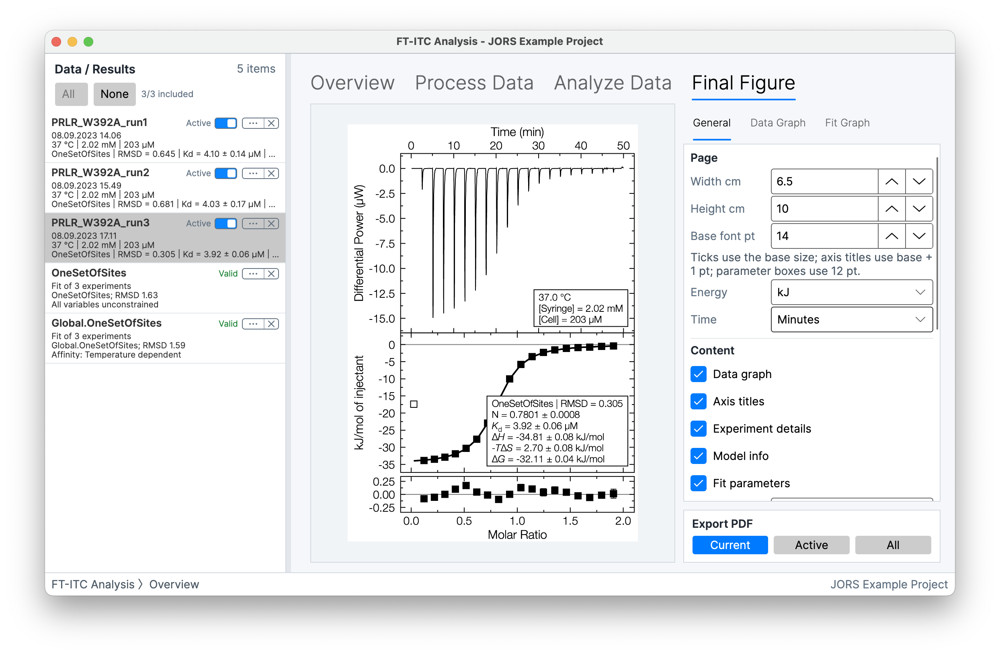
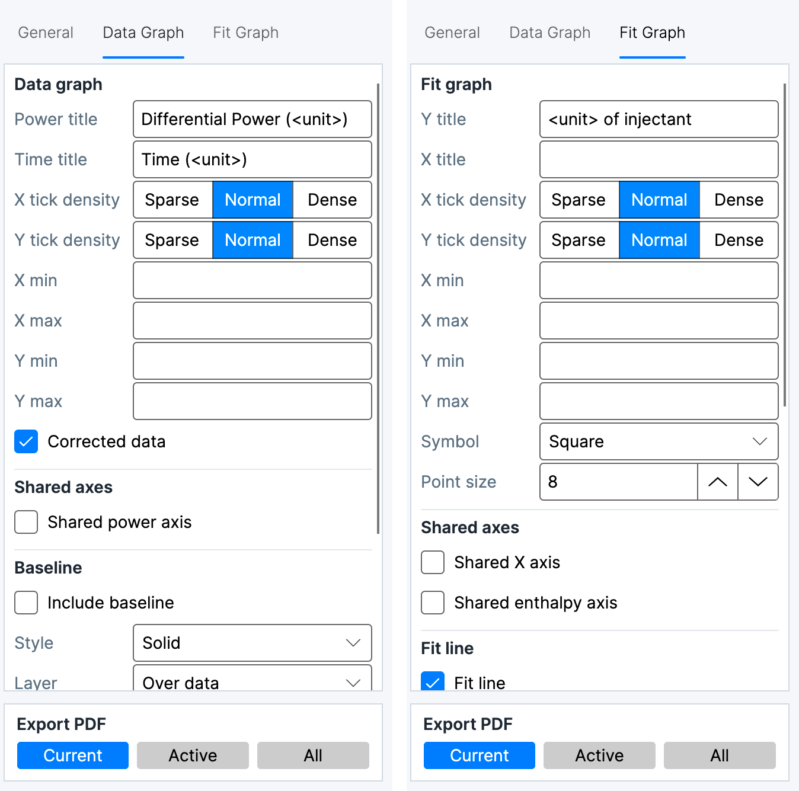
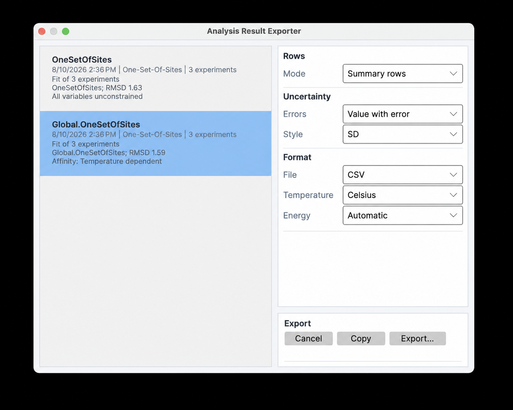
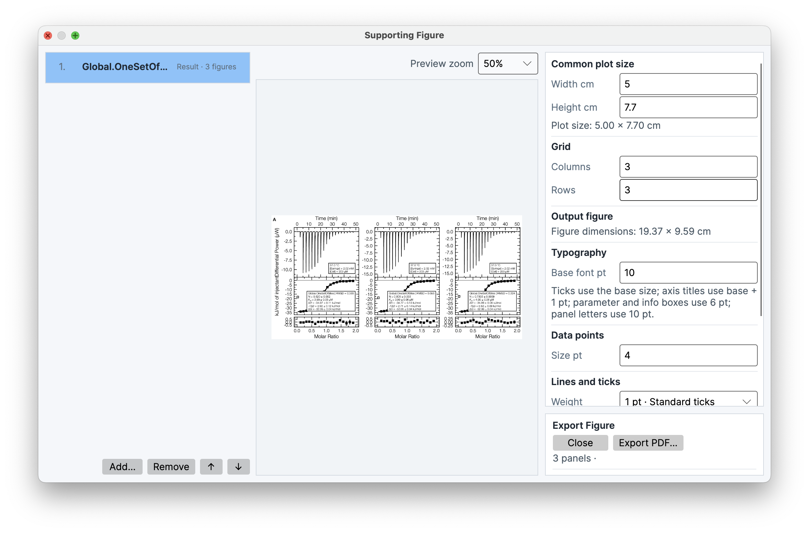

# Figures and export

Choose a figure when you want to show a graph, a data export when you need injection values, and a result table or report when you need to share fitted quantities and their context. Check the selected experiments, units, and uncertainty display before sending an output.

FT-ITC Analysis keeps publication figures, numerical data, and fitted result tables as separate output types. **Final Figure** is an Experiment Data workflow. An Analysis Result does not open directly as a Final Figure; **Export Associated Final Figures...** on a result exports figures for the experiment solutions associated with that result.

## Final Figure

The **Final Figure** workspace renders the selected Experiment Data as a publication figure. Its preview and PDF output reflect the selected experiment, processing state, fitted solution, and figure options. To export figures using the fits stored in an Analysis Result, use **Export Associated Final Figures...** on that result.

The **Export PDF** controls offer three scopes:

- **Selected** opens a save dialog for the displayed experiment figure and suggests the experiment name as the PDF filename.
- **Active** exports figures for Active Experiment Data. **All** exports figures for all Experiment Data in the project.

For **Active** and **All**, choose a parent folder and the app creates or reuses a subfolder named after the saved project file (without its extension). For an unsaved session, it uses the local export date (`yyyyMMdd`) as the folder name. Existing PDFs are kept; when a filename is already in use, the new figure gets a numeric suffix such as `Experiment (2).pdf`.

The result-list command **Export Associated Final Figures...** writes one final-figure PDF per member experiment using that result's saved fit. Each saved solution is attached only while its figure is made; the experiment's previous solution is restored afterward. It is available for a result with exportable solutions. See [Results and advanced analyses](08-results-advanced-analysis.md) for result validity and stored member-solution behavior.

For a result assessed as **No binding detected**, associated final figures use the saved Offset comparison and identify when saved observations differ from current processing. They do not show binding-fit bands or binding-parameter annotations.

> **Where Final Figure settings are used**
>
> - **Final Figure PDFs**, including Active, All, and **Export Associated Final Figures...**, use the current Final Figure appearance controls.
> - **Supporting Figure...** starts with a snapshot of those controls when its window opens. This includes units, axis limits, visible traces and fits, and excluded-point automatic Y scaling. Its own plot size, grid, typography, panel labels, grouping, and information-box controls take precedence; later Final Figure edits do not update an already open Supporting Figure.
> - **Analysis Report** uses a separate compact figure preset and its own energy and uncertainty selections. Final Figure axis limits and excluded-point automatic Y scaling do not carry over to report figures.

### General

The **General** tab defines the page and common content. Page controls specify width and height in centimeters and the base font size. The **Energy units** selector provides **Automatic**, **J**, **kJ**, **cal**, and **kcal**. **Automatic** chooses a common molar-energy unit based on the figure's plotted and reported central values. A fixed choice uses the selected energy unit throughout the figure, except for the thermogram units described below. The selected family also controls thermogram units: differential power is **µW** or **µcal/s**, while integrated heat is **µJ** or **µcal**. Time controls set the displayed time unit. Content controls include the data graph, axis titles, experiment details, model information, fit parameters, and the information-box placement. The uncertainty selector provides **Automatic**, **SD**, **CI**, **SD + CI**, and **None**. **Automatic** uses the same per-quantity asymmetry rule described under [Uncertainty and evaluation temperature](08-results-advanced-analysis.md#uncertainty-and-evaluation-temperature).

The parameter controls determine which information appears in the information box: thermodynamic, derived, or offset parameters; temperature; concentrations; injection delay; instrument; and user-defined attributes. The information box is descriptive figure content and does not alter the underlying fit.

### Data Graph

The **Data Graph** tab controls the differential-power trace. Power and time axis titles, tick density, and explicit minimum and maximum values define the axes. **Corrected data** selects the baseline-corrected trace when one is available. **Shared power axis** applies one power-axis range across the active experiments represented by a figure set.

Baseline controls expose the baseline, its **Solid** or **Dashed** style, **Under data** or **Over data** layer, and line width. **Integration ranges** displays the integration intervals as **Bar**, **Fill**, or **Endpoint lines**. These overlays describe processing and do not recalculate integration.

### Fit Graph

The **Fit Graph** tab controls the integrated-heats and model panels. Enthalpy and molar-ratio axis titles, tick density, and explicit ranges define the axes. Symbols are **Square** or **Circle**, with an independent point size. **Shared X axis** and **Shared enthalpy axis** unify the corresponding ranges across active experiments; the residual-axis range follows the shared enthalpy setting when configured for unified residual axes.

**Include excluded points in automatic Y scaling** lets excluded injections affect the automatic integrated-heat and residual axis ranges. It starts from the application preference. Explicit axis limits take precedence.

**Fit line** displays the fitted binding curve with a selected width and **Smooth**, **Spline**, or **Linear** smoothness. **Show residuals graph** adds the residual panel, and **Residual gap** separates it visually from the fit panel. The display controls include the zero enthalpy line, confidence band, error bars, excluded points, excluded error bars, and offset-corrected heats. Error bars use processed injection uncertainties; confidence bands require bootstrap uncertainty in the fitted solution; fit lines and residuals require a fitted solution.

## Numerical data export

**File > Export Data...** opens the numerical export dialog. **Export Selected Data...** invokes the same export for the selected experiment. The data scope is one of **Selected experiment**, **Active experiments**, or **All experiments**.

The format list contains:

- **Thermogram Data** — a `.csv` file containing time and power samples, with the **Export baseline-corrected trace** option when baseline-corrected samples exist.
- **Integrated Peaks** — a `.csv` file containing injection-axis values, molar heats, their SD, fitted values, and residuals when available, with **Export offset-corrected peaks** when a fitted solution is available.
- **Combined Data** — a `.csv` file placing thermogram samples and integrated-peak columns side by side; raw, corrected, fitted, and residual columns are included when available.
- **MicroCal / SEDPHAT** — a `.dat` file with MicroCal-style `DH`, `INJV`, `Xt`, `Mt`, `XMt`, `NDH`, `DY`, and `Fit` columns. `DH` is in µcal, `INJV` is in µL, concentrations are in mM, and `NDH`, `DY`, and `Fit` are in cal/mol. The first injection uses `--` for normalized heat and residual, following the conventional excluded-first-injection layout.
- **pytc** — a `.dh` file containing the pytc-compatible injection and metadata fields.
- **ITCsim** — a `.csv` file containing ITCsim-compatible injection data and metadata, with offset-corrected peaks available when a fitted solution exists.

**Molar-energy unit** is available for Integrated Peaks, Combined Data, and ITCsim: choose **J/mol**, **kJ/mol**, **cal/mol**, or **kcal/mol**. Each export dialog starts at kJ/mol for the Joules energy preference or kcal/mol for the Calories preference; a choice applies to that export only. Integrated Peaks and Combined Data identify the chosen unit in the heat, SD, model, and residual column headers. ITCsim keeps its `PeakHeat` column name and records the unit as `#EXPINFO ENERGYUNIT J`, `KJ`, `CAL`, or `KCAL`; those tokens denote energy per mole. Peak area is an absolute heat in J and is distinct from the exported molar heat.

Other output units remain format-specific. Thermogram samples use seconds and watts; MicroCal/SEDPHAT and pytc use their documented concentration, volume, temperature, and heat conventions. Fitted columns and correction controls are disabled when the selected data do not contain the corresponding processed or fitted state. Export defaults are described in [Settings and defaults](11-preferences-troubleshooting.md).

These exports are not project backups. General `.csv` and `.tsv` exports cannot be reopened through **File > Open...**. A MicroCal / SEDPHAT `.dat` export or pytc `.dh` export can be reopened as integrated-heat input, but doing so restores neither a thermogram nor the FT-ITC project state and requires choosing the source heat unit. Select **microcalorie** for the `DH` column when reopening a newly generated MicroCal / SEDPHAT export. Historical FT-ITC `.dat` exports may instead require **joule**, matching the unit used when they were created. Save an `.ftxtc` project when the analysis must remain editable.

## Analysis Result Exporter

**Analysis Result Exporter...** builds a table from one or more selected Analysis Results. **Summary rows** produces one row per result; **All replicate rows** produces one row per member fit. Error layout is **Value with error** or **Separate columns**. Uncertainty style is **SD**, **CI**, or **SD + CI**. The file format is **CSV** or **TSV**. **Energy units** provides **Automatic**, **J**, **kJ**, **cal**, and **kcal**. Automatic chooses one stable molar-energy unit across all selected results and one independent unit for ΔCp columns; a fixed choice uses the selected energy unit consistently. Temperature presentation is **Celsius** or **Kelvin**.

The configured table is available through **Copy** and **Export...**. Copy places the same delimited text on the clipboard; Export writes it to a file. Profile-likelihood SD columns use the equivalent display scale implied by their stored endpoints and are labeled as such in exported metadata; the exact lower/upper endpoints remain available in separate-column mode. The exporter does not include the parameter-correlation matrix, which is calculated for display rather than stored as a result-table field.

Summary rows use the same Parameter Evaluation calculation at its default evaluation temperature: the configured reference temperature for a temperature series, otherwise the mean experiment temperature. The exported temperature column labels that evaluation temperature. Local summary rows report **Combined SD** and an **Approximate propagated interval**, using the same calculation described under [Parameter Evaluation](08-results-advanced-analysis.md). Summary interval columns have neutral `_interval_lower` and `_interval_upper` suffixes; individual rows retain their CI95 columns. Kd is derived from the summarized Gibbs energy rather than averaged directly, and ΔCp columns are included for applicable temperature-dependent results. No results are pooled across separate analyses.

Result tables, clipboard output, final-figure metadata, and viewer output create
thermodynamic columns according to the fitted model. A sequential result therefore
exports one Kd, ΔH, ΔG, and −TΔS value for every active step, including steps 3
and 4 when present. The fixed step
count is included as model information. Exporting preserves the interpretation of these values: macroscopic sequential
constants remain step constants, not microscopic site constants.

Each affinity column chooses its concentration unit independently from its own
magnitude. For example, Kd1 may be shown in nM while Kd4 is shown in µM. The
column header and its values always use the same unit; this is display scaling
only and does not change fitted or saved values.

## Analysis Report

**Tools > Analysis Report...** creates a complete, printable report from one or more saved Analysis Results. The same tool is available as **Export Analysis Report...** in result-specific menus, where that result is initially selected. Use **Select report contents...** to choose results and optional supporting experiments together. The picker follows application order; applying the same ordered selection again restores its saved study context and approved interpretation. At least one result is required.

### Report contents and layout

The report is a printable A4 PDF. It starts with a front page that lists the included results and the contents, followed by a chapter for each result. An approved interpretation follows the front page. Results are referenced as **1**, **2**, and so on, and their experiments as **1A**, **1B**, **2A**, **2B**, and so on. Figures and interpretation use these same references. Results remain separate even when they use the same experiment.

The analysis summary includes a thermodynamic chart for each result member and active binding step. Its whiskers show saved 95% confidence intervals; SD values remain available in the tables. Experiment sections include the thermogram where available, a final figure, fitted and derived parameters, and selected correlations. **Fit details** reports dimensionless c-values where the model defines them. For one- and two-site models, the Wiseman value is `c = N[cell]₀/Kd`; syringe correction uses the fixed site count. Sequential fits report `[cell]₀/Kd` for each active step, while competitive fits use the apparent `Kd_app`. When **Injection tables** is selected, the report includes each injection's inclusion state, volume, concentrations, heat, uncertainty, fitted heat, and residual. An unavailable thermogram is identified in the report.

Each result reports the concentration and injection-heat bookkeeping saved with its fit. Buffer subtraction summaries and fitted-experiment details use only the settings saved with that fit; missing saved settings are identified as unrecorded. Parameter tables identify fixed estimates and omit uncertainty intervals for them. Processing details, observations, and injection tables describe **Current experiment data**, while fitted parameter values come from the saved result. Supporting experiments have no saved fit settings, so their subtraction details are omitted; correction provenance remains available where relevant.

Directly selected experiments that are not represented by a selected result appear once in a report-level **Supporting experiments** chapter after the result chapters and are labeled **S1**, **S2**, and so on. The report uses only saved content: a raw thermogram with any saved baseline and integration boundaries, finite integrated heats explicitly labeled as having no fit, experiment metadata, notes about processing or correction exceptions, dates with a verified source (including filesystem dates in Traceability Mode), attributes, comments, and the report-wide optional injection table. Missing stages receive concise availability notices. Experiments already represented by a checked result remain visible but unavailable as supporting selections. Recorded buffer-subtraction references may be selected automatically according to the application setting, but remain ordinary optional selections; the report does not judge whether a reference is an appropriate blank. Report creation never fits, reintegrates, or performs subtraction.

### Configure the report

Choose a title, an optional subtitle, energy and temperature units, and an **Uncertainties** style. Reports default to **SD + 95% CI**. The selected style controls uncertainty in tables and applicable analysis plots; the thermodynamic summary chart shows available saved 95% confidence intervals. Presentation choices are saved with the report.

**Traceability Mode** adds the report preparer, generation time, a signature/date line, saved **Analysis operator** names, result identifiers, and recorded experiment and sample identifiers. Enter a **Report ID** to identify the report in its signature and report details; the ID is saved with the report and a blank ID appears as **Not recorded**. The report preparer is the current operator when the preview is built; the analysis operator identifies who created or last updated the fit, and can be different. A blank preparer name appears as **Not recorded** while the PDF Author field remains empty. Experiment dates are reported only when they come from the data file or were entered by the user. An experiment that only has a filesystem timestamp shows it as **Experiment date (file system date)**, which does not establish when the experiment was run. If the current operator changed after the preview was built, export automatically rebuilds and refreshes the preview with the current name before writing the PDF. Missing experiment IDs appear as **Not recorded** only in Traceability Mode; otherwise, blank IDs are omitted. Missing IDs do not prevent report creation or export.

Each experiment’s parameter table labels values **Fixed**, **Fitted**, or **Derived** based on the saved solution and global constraints. Fixed estimates retain their values and units but do not show uncertainty decoration.

**Optional content** includes **Injection tables**, **Condense repeated experiments**, **Expanded explanations**, **Parameter correlations**, and completed advanced analyses. Expanded explanations adds contextual notes for approximate summary uncertainty, weighted fit diagnostics, and others. 

Condensing repeated experiments replaces repeated acquisition and processing details with a reference to the first occurrence, while retaining each result's figures, fit, and scientific context. The analyses you select are included from their saved results; report creation does not rerun them.

### Write and preview an interpretation

The builder provides an editor for your remarks. A formatting hint shows the available Markdown shortcuts: `##` section headings, `###` subsection headings, `-` bullets, `**bold**`, and `*italic*` emphasis. Use **Interpretation / Preview** to switch between writing and the rendered report. **Preview** shows the current report, **Update Preview** refreshes it after edits, and **Export PDF...** saves it. Results with warnings or outdated inputs remain exportable with a prominent notice. A structurally unusable result shows a validation error and cannot be previewed or exported.

### Generate an automated interpretation

**Online generation privacy:** Generate sends selected names, comments, conditions, fits and injection evidence, plus your question or context, to the FT-ITC online interpretation service, which uses OpenAI to generate a response. Thermograms start unchecked each time the generator opens and require an explicit opt-in. The service retains usage metadata without automatic expiry; full scientific evidence and generated prose are not included in that metadata. Provider and infrastructure retention are separate; no deletion deadline is guaranteed. Canceling does not retract sent data. Local processing, fitting, saving and export work without generation. [Data flow and retention](03-installation-files-projects.md#privacy-and-online-checks).

The inspector’s **Interpretation** section reports whether the text is manual, automatically generated, user edited, or out of date. **Edit** returns focus to the large editor. **Generate interpretation…** opens a dialog with optional **Main question** and **Additional context** fields. Use the question to focus the assessment and the context to explain the experiment. The cross-platform dialog labels its preset selector **Interpretation depth**. Requesting generation sends the selected report evidence and these inputs to the online interpretation service. Compressed thermograms are unchecked each time the generator opens; if **Include compressed thermograms** is available for your access, you can opt in for that request.

Generation assesses all selected results and supporting experiments together, using the same references as the PDF. Results remain independent, including alternative fits of the same experiment. Supporting experiments contribute available observations and metadata without being assigned a fitted result or assumed control role. Generation uses existing processing, integration, residual, and uncertainty evidence where available; it does not rerun integration, baseline fitting, or model fitting. When compressed thermograms are included, they contain minimum and maximum power values for each 15-second interval, plus an aligned fitted baseline when available. Exact peak timing, the order of values within each interval, and the detailed waveform are unavailable. The dialog shows the compact package size against your current request limit and blocks generation when the estimated request is too large. An opted-in thermogram is retained in the request; a size or model-context error is shown instead of silently omitting it.

When generation succeeds, the desktop app sends an **Interpretation ready** system notification. Whether it appears depends on operating-system notification support and permissions. The draft remains available in the generation dialog for review.

Completed structuring, electrostatics, and protonation analyses are included when available for the selected results.

If the selection contains outdated or failed analyses, a warning gives you an opportunity to review them before continuing. The report distinguishes saved fit inputs and estimates from current observations; some comparisons are unavailable when the saved fit cannot be matched to the current data. An interpretation can identify potential concerns, but it does not certify the experiment or establish a mechanism. The service may suggest references from details such as a paper title, journal, or year, but it does not search the web.

Review and edit the returned draft, then choose **Use in report** to add it to the report. Check its scientific claims and references against the underlying results.

Markdown tables require a header and separator row. Use a few columns to keep them readable; unsupported formatting may appear as literal text in the report.

Canceling, closing the dialog, or encountering a service error leaves previously approved text unchanged. Study context, the thermogram setting, approved text, and generation details are saved with the report. Changes to selected results, supporting evidence, context, or settings can mark an approved automated interpretation as out of date. Older approved interpretations remain readable even when their freshness cannot be verified. The report distinguishes manually written interpretations from automatically generated text and subsequent edits.

Local report editing and PDF export remain available if automated interpretation is unavailable.

### Save a local copy of interpretation evidence

Use **Save package** in the generation dialog to save a local ZIP of the evidence, question, context, and settings selected for that request. Saving the ZIP does not contact the interpretation service or run new fits. The archive contains scientific data and context; review it before sharing.

### Troubleshoot automated interpretation

If generation fails, note the visible error and use **Copy Support Report** when contacting support. Local report editing and PDF export remain available if online generation is unavailable.

### Choose the appropriate output tool

The Analysis Report is distinct from the other output tools:

- **Analysis Result Exporter** writes compact CSV or TSV tables for numerical reuse.
- **Final Figure** writes a publication figure for an experiment, while **Export Associated Final Figures...** writes one figure per result member.
- **Supporting Figure** composes selected figures into one multi-panel canvas.
- **Analysis Report** assembles one or more saved results as self-contained chapters with figures, detailed tables, diagnostics, optional advanced plots, and source and analysis history.

## Supporting Figure

**Supporting Figure...** composes figures from Experiment Data and Analysis Results into a multi-panel canvas. The **Figure order** list defines source order; **Add…**, **Remove**, **Up**, and **Down** change the composition. The source picker can filter available experiment and result figures by name or type.

Set the plot size, grid columns and rows, font size, point size, line weight, and tick style for the composed figure. Extra panels continue on additional PDF pages. **Light** and **Standard** provide different line and tick weights. **Panel letters** labels panels A, B, and so on; **Panel titles** can add experiment names. **Group result figures** and the information-box controls adjust how results are presented. Review the preview, then choose **Export PDF...**.

## Printing

**File > Print** prints the active graph or figure through the operating system’s print workflow. The active target can be the overview thermogram, processing graph, analysis graph, result graph—including an available **Correlation** matrix—or Final Figure, depending on the selected workspace. The operating-system print dialog supplies the available printer and PDF destinations; the graph content comes from the active application view.
