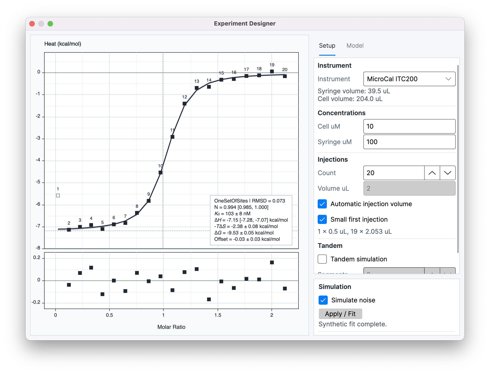
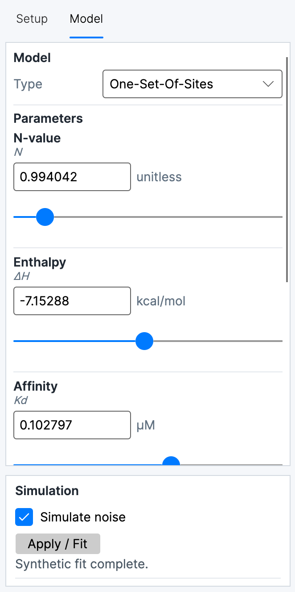
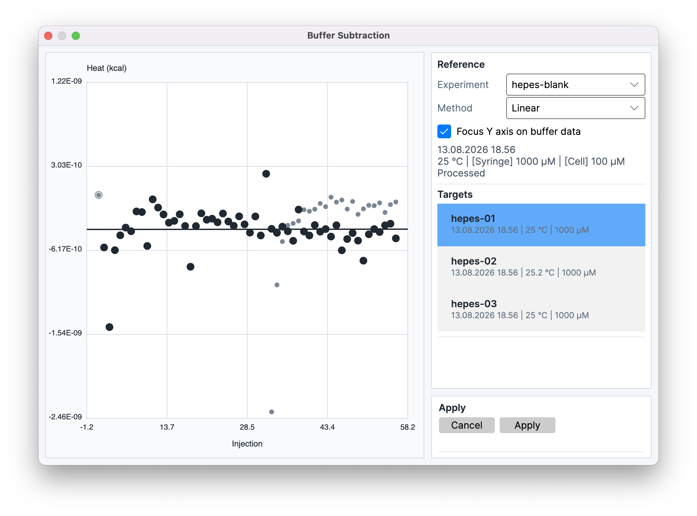
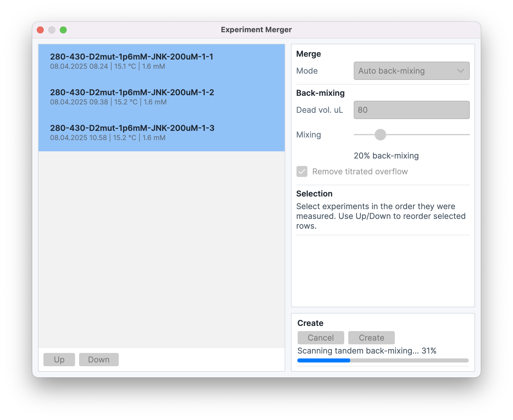

# Tools

The **Tools** menu contains **Experiment Designer...**, **Buffer Subtraction...**, and **Experiment Merger...**. They have different output lifecycles: Experiment Designer keeps simulation and fitting inside its window, Buffer Subtraction stores a correction on target experiments, and Experiment Merger creates a new processed Experiment Data item. Source and target selection uses the project state described in [Workspace](04-workspace-experiments.md).

## Experiment Designer

**Experiment Designer...** creates a synthetic titration from instrument, concentration, injection, and model parameters. The graph updates as the design changes. The designer does not add the synthetic experiment or its fit as a project item.

### Setup and model controls

The **Setup** tab contains **Instrument**, **Cell uM**, **Syringe uM**, injection **Count**, and **Volume uL**. Count and volume define the injection schedule. **Automatic injection volume** derives the injection volume from the selected instrument’s standard syringe volume and injection count. **Small first injection** gives the first injection of each load a smaller volume and marks it excluded. **Tandem simulation** creates consecutive loads, with **Segments** defining their count and the designer’s tandem back-mixing model.

The **Model** tab contains **Type**, exposed model **Parameters**, and model-specific **Options**. **Simulate noise** adds synthetic measurement noise. **Apply / Fit** fits the synthetic data in the designer window and reports the fit on its graph; neither the simulation nor this fit becomes an Analysis Result or Experiment Data entry.

## Buffer Subtraction

**Buffer Subtraction...** models background heat from one processed reference experiment and applies the resulting correction to one or more target experiments. The reference selector shows experiment metadata and a **Processed** or **Not yet processed** status. The target list excludes the selected reference and supports multiple targets. A processed reference is required; its processing state is described in [Processing](05-processing-thermograms.md).

The **Method** selector contains **Matched**, **Linear**, and **Exp. decay**:

- **Matched** evaluates the reference heat at each target injection number, using nearby included reference injections when the matching injection is unavailable.
- **Linear** fits a line through valid, included reference injections and evaluates it across target injections.
- **Exp. decay** fits an exponential-decay model through valid, included reference injections when enough points are available.

The preview graph shows reference and target heats and the selected subtraction model. Reference-point inclusion changes the points available to the fitted methods. **Focus Y axis on buffer data** changes only the preview range. A continuous model line appears for **Linear** and **Exp. decay**; **Matched** is represented by injection-level reference values.

> **Calculation:**
>
> *q*i,corr = *q*i,target − *q*i,ref
>
> The selected method determines the reference value evaluated for injection *i*. *q*i,target is the target heat, *q*i,ref is the corresponding reference value, and *q*i,corr is the corrected heat used downstream.

**Apply** stores the reference and method on each target. The corrected heats are then used by downstream fitting and export while the original integrated heats remain unchanged. The reference Experiment Data becomes inactive. Changes in its processing or injection inclusion update the target corrections. The subtraction is project data and can affect the validity of dependent results.

## Experiment Merger

**Experiment Merger...** joins two or more eligible thermogram experiments from consecutive segments of a tandem titration. The source list contains thermograms that are not already tandem experiments. Selection order defines segment order; **Up** and **Down** reorder selected rows.

The merge **Mode** selector contains:

- **Simple tandem**, which concatenates the segments using the standard concentration progression without a user-selected back-mixing correction.
- **Fixed back-mixing**, which applies one configured mixing fraction at every segment transition.
- **Auto back-mixing**, which scans for a transition mixing fraction and is available for up to three source experiments.

Back-mixing controls include **Dead vol. uL**, the **Mixing** fraction, and **Remove titrated overflow**. Dead volume represents the filling-stem or overflow volume above the active cell volume. The overflow control records whether titrated overflow was removed between segments. In Fixed mode, the slider supplies the fraction; in Auto mode, the scanner determines the transition values.

**Create** produces a new processed Experiment Data item. Its thermogram samples are time-shifted and concatenated, its injection sequence retains segment boundaries, and its segment metadata stores the calculated starting active-cell and active-titrant concentrations. The merged item’s comments record the selected tandem mode and back-mixing parameters. Source experiments remain separate and are not changed by creation; the new item is marked as a tandem experiment and is not eligible as a later merger source. The resulting item can be fitted through [Analyze Data](06-fitting-models.md).

## Interpretation of tool state

The tools expose state labels rather than claims about physical history. Buffer reference status **Processed** means integration has completed; **Not yet processed** means that prerequisite is absent. The merger status **Invalid back-mixing settings** describes control validation, while **Auto back-mixing is available for up to three experiments** describes the scanner limit. A selected mixing fraction or fitted subtraction model is a software correction with model uncertainty, not a measurement of unobserved liquid mixing or background heat.

Changes to reference inclusion or processing change the subtraction preview and target correction. Existing merged Experiment Data is a separate snapshot and does not update when its source experiments are edited.
