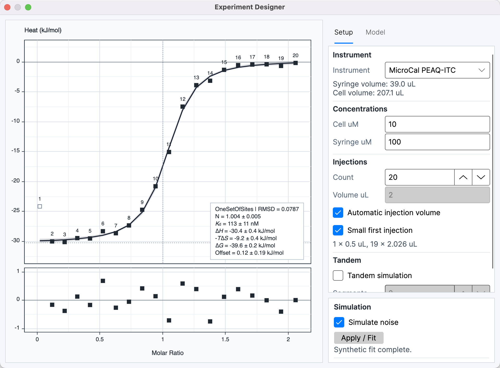
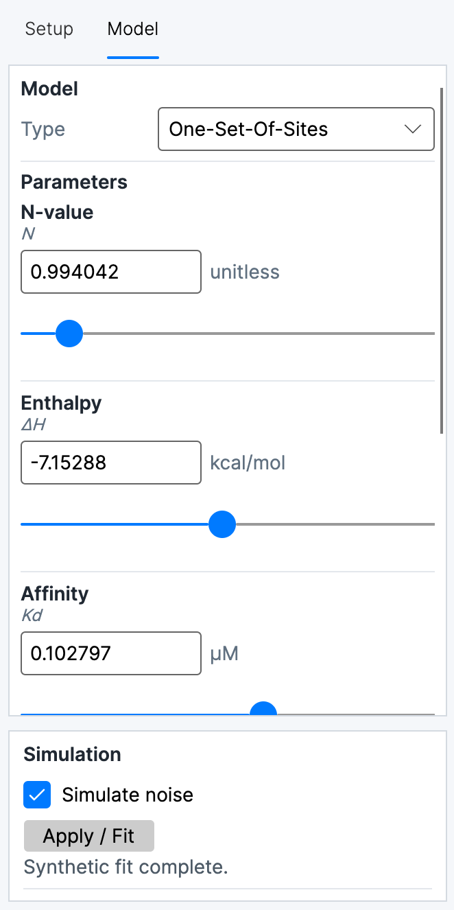
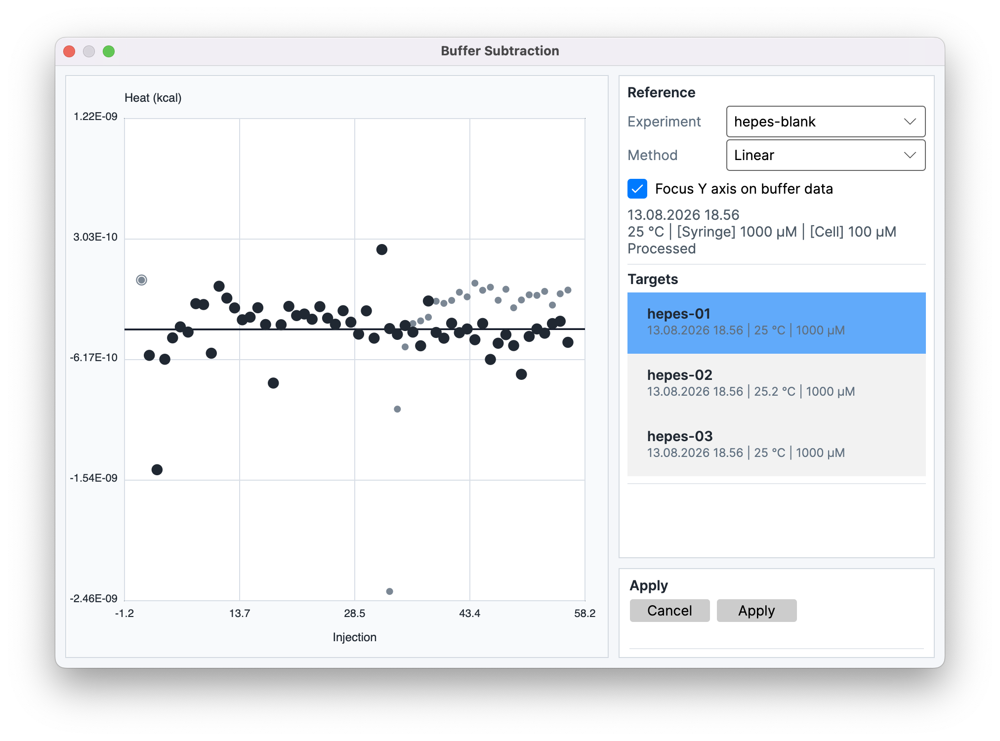
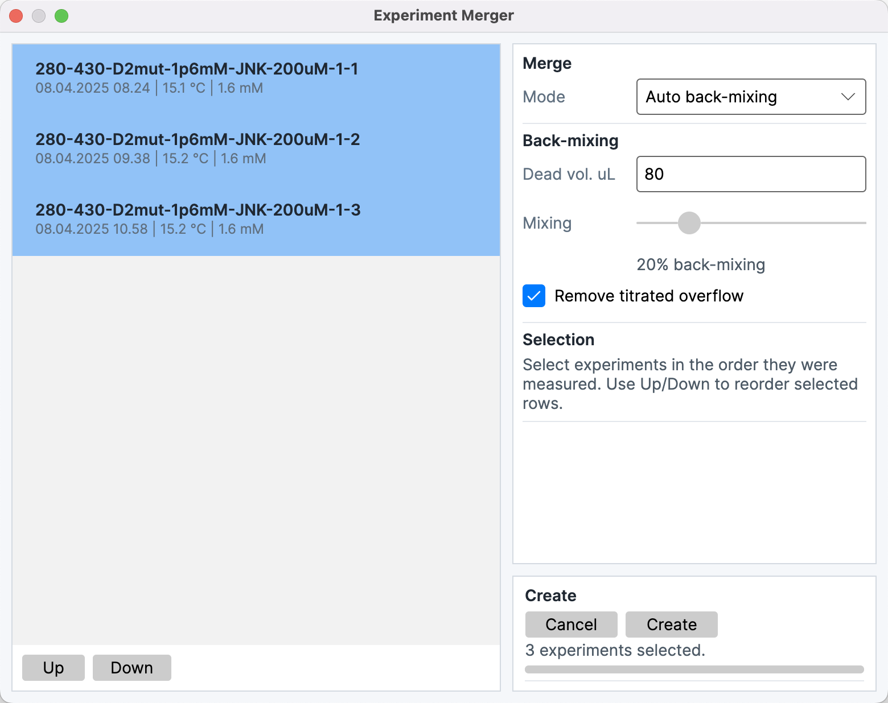

# Tools

Use **Experiment Designer...** to explore a simulated experiment before collecting data, **Buffer Subtraction...** to account for heat seen in a reference experiment, and **Experiment Merger...** to join consecutive parts of a titration. The sections below explain what each tool takes as input and what it changes in your project.

The **Tools** menu contains **Experiment Designer...**, **Buffer Subtraction...**, and **Experiment Merger...**. Each tool handles its output differently: Experiment Designer keeps simulation and fitting inside its window, Buffer Subtraction stores a correction on target experiments, and Experiment Merger creates a new processed Experiment Data item. Source and target selection uses the project state described in [Workspace](04-workspace-experiments.md).

## Experiment Designer

**Experiment Designer...** creates a synthetic titration from instrument, concentration, injection, and model parameters. The graph updates as the design changes. The designer does not add the synthetic experiment or its fit as a project item.

### Setup and model controls

The **Setup** tab contains **Instrument**, **Cell uM**, **Syringe uM**, injection **Count**, and **Volume uL**. Count and volume define the injection schedule. **Automatic injection volume** derives the injection volume from the selected instrument’s standard syringe volume and injection count. **Small first injection** gives the first injection of each load a smaller volume and marks it excluded. The **Simulation** section contains noise controls. **Tandem simulation** creates consecutive loads, with **Segments** setting the number of loads. The designer uses its tandem back-mixing model between loads.

The **Model** tab contains **Type**, exposed model **Parameters**, and model-specific **Options**. Parameter sliders use practical editing ranges; enter a value in the text field to set a value beyond a slider's range. 

## Buffer Subtraction

> **Before you begin:** Buffer subtraction operates on integrated injection heats. Use experiments with available heats to inspect the correction in the preview; thermogram inputs need processing to supply those heats.

**Buffer Subtraction...** models background heat from one reference experiment and applies the resulting correction to one or more target experiments. The reference selector shows experiment metadata and a **Processed** or **Not yet processed** status. The target list excludes the selected reference and supports multiple targets. The correction uses the reference's available integrated heats; if the reference is processed later, target corrections update. Processing is described in [Processing](05-processing-thermograms.md).

The **Method** selector contains **Matched**, **Linear**, and **Exp. decay**:

- **Matched** evaluates the reference heat at each target injection number, using nearby included reference injections when the matching injection is unavailable.
- **Linear** fits a line through valid, included reference injections and evaluates it across target injections.
- **Exp. decay** fits an exponential-decay model through valid, included reference injections when enough points are available.

The preview graph shows reference and target heats and the selected subtraction model. Reference-point inclusion changes the points available to the fitted methods. **Focus Y axis on buffer data** changes only the preview range. A continuous model line appears for **Linear** and **Exp. decay**; **Matched** is represented by injection-level reference values.

> **Calculation:**
>
> *q*i,corr = *q*i,target − *q*i,ref
>
> *σ*i,corr = √(*σ*i,target2 + *σ*i,ref2)
>
> The selected method determines the reference value evaluated for injection *i*. *q*i,target is the target heat, *q*i,ref is the corresponding reference value, and *q*i,corr is the corrected heat used for fitting and export. The *σ* values are standard deviations (SDs). The corrected heat's SD combines the target and reference SDs as independent errors; subtracting the heats does not subtract their SDs.
>
> With **Matched**, the reference SD comes from the matched injection. If the method uses the average of the nearest included injections on either side, its SD is half the square root of the sum of their squared SDs. With **Linear** or **Exp. decay**, the subtracted reference value is the fitted line or curve, so the reference SD is the uncertainty of that fitted value at injection *i*, not the scatter of single reference heats. It is calculated from the scatter of included reference heats around the fit (not their individual error bars) and from how well the included injections determine the fit at injection *i*. Because the fit averages over many injections, this SD is usually much smaller than the scatter and is largest near the ends of the reference range. The same fitted curve corrects every injection, so this part of the error is shared between injections rather than independent. If the fit has no degrees of freedom left to estimate that scatter, the model assigns a reference SD of zero; this does not establish that the correction is exact.

**Apply** stores the reference and method on each target. The corrected heats are then used for subsequent fitting and export while the original integrated heats remain unchanged. The reference Experiment Data becomes inactive. Changes in its processing or injection inclusion update the target corrections. The subtraction is project data and can affect the validity of dependent results.

## Experiment Merger

> **Before you begin:** Select at least two source experiments with thermograms. The merger uses a source's baseline-corrected trace when available and its raw trace otherwise. It processes the newly merged Experiment Data automatically.

**Experiment Merger...** joins two or more eligible thermogram experiments from consecutive segments of a tandem titration. The source list contains thermograms that are not already tandem experiments. Selection order defines segment order; **Up** and **Down** reorder selected rows.

The merge **Mode** selector contains:

- **Simple tandem**, which concatenates the segments using the standard concentration progression without a user-selected back-mixing correction.
- **Fixed back-mixing**, which applies one configured mixing fraction at every segment transition. With three or four selected experiments, you can instead set an individual fraction for each reload.
- **Auto back-mixing**, which estimates the reload mixing fractions from the selected experiments and is available for up to five source experiments.

Back-mixing controls include **Dead vol. uL**, the **Mixing** fraction, and **Remove titrated overflow**. Dead volume represents the filling-stem or overflow volume above the active cell volume. The overflow control records whether titrated overflow was removed between segments. In Fixed mode, the shared slider supplies the fraction. With three or four experiments selected, enable the individual-fractions option to set **Reload 1**, **Reload 2**, and, for four experiments, **Reload 3** separately. Auto mode estimates the values from the selected data; these are model-based estimates rather than direct measurements of mixing.

### What happens at a reload

In **Fixed back-mixing** and **Auto back-mixing**, the model tracks the active cell and the dead/overflow volume separately. It starts with the same macromolecule concentration in both and no syringe ligand in either. During a segment, injections change the active-cell concentrations and displaced material enters the dead volume. At the transition to the next segment, the model first removes overflow if **Remove titrated overflow** is selected, then mixes the chosen fraction of the remaining dead volume with the active cell. The resulting active-cell concentrations become the starting concentrations for the next segment. This changes the calculated concentrations used for fitting; it does not add a heat peak or alter the measured thermogram.

> **Calculation:** For each species (macromolecule and syringe ligand), let *V*cell and *C*cell be the active-cell volume and concentration just before mixing, *V*dead and *C*dead the remaining dead-compartment volume and concentration, and *f* the selected mixing fraction.
>
> *V*mix = *f* · *V*dead
>
> *C*next = (*V*cell · *C*cell + *V*mix · *C*dead) / (*V*cell + *V*mix)
>
> If overflow is removed, the model first removes a volume equal to the injections delivered in the completed segment, capped at the available dead volume. It assumes that compartment is well mixed, so removal takes the same proportion of each species. The formula then uses the volume and concentrations left behind. A mixing fraction of 0 leaves the active-cell concentrations unchanged; a fraction of 1 includes all remaining dead-compartment liquid in the mixing calculation. The active-cell volume itself stays fixed, and the model retains the remaining material in the dead compartment for later transitions.

**Create** produces a new processed Experiment Data item. Its thermogram samples are time-shifted and concatenated, its injection sequence retains segment boundaries, and its segment metadata stores the calculated starting active-cell and active-titrant concentrations. The merged item’s comments record the selected tandem mode and back-mixing parameters. Source experiments remain separate and are not changed by creation; the new item is marked as a tandem experiment and is not eligible as a later merger source. It is a snapshot and does not update if its source experiments are subsequently edited. The resulting item can be fitted through [Analyze Data](06-fitting-models.md).

When the first source experiment has an external experiment ID, the merged experiment's ID is that value followed by `-concat`; if its ID is blank, the merged ID stays blank. The cell and syringe sample/batch IDs are copied only when every source has the same nonblank value; otherwise the merged IDs are blank. The merger does not open the import review, so use **Tools > Edit identifiers…** to add or change IDs on the merged experiment.

The new experiment uses the **Injection bookkeeping** method selected in **Preferences > Processing** for dilution during each injection. That choice is separate from the merger’s between-segment back-mixing setting. See [Injection bookkeeping](06-fitting-models.md#injection-bookkeeping-microcal-and-dumas) for the methods and their limits.

> **Interpretation:** A configured or automatically fitted back-mixing fraction is a model-based correction, not a direct measurement of liquid mixing that occurred between runs.
